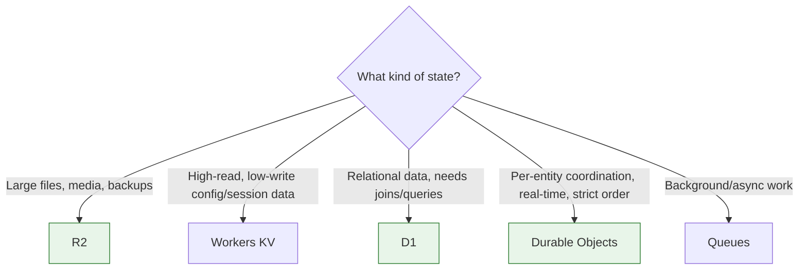

# Building on the Developer Platform

Cloudflare's developer platform is the other half of the Adopt phase: instead of migrating existing traffic, you're building new applications directly on Cloudflare's edge compute and storage primitives. Two decisions matter most up front:

1. Workers vs. Pages as your deployment target.
2. Which storage primitive — R2, KV, D1, or Durable Objects — fits each piece of state your application needs.

Both are easy to get wrong by defaulting to whichever product you've heard of first, rather than the one matching the actual access pattern.

## Storage decision flow

This mirrors [Cloudflare's own storage decision guide](https://developers.cloudflare.com/workers/platform/storage-options/) — the deciding question is always the access pattern, not familiarity with a given product.

## Key Cloudflare capabilities

| Capability | What it does | Reference |
|---|---|---|
| Workers | General-purpose serverless compute platform running at Cloudflare's edge; now also serves static assets and supports server-side rendering | [Workers overview](https://developers.cloudflare.com/workers/) |
| Pages | Git-integrated static/JAMstack hosting with a functions layer that compiles to a Worker under the hood | [Pages overview](https://developers.cloudflare.com/pages/), [Migrate from Pages to Workers](https://developers.cloudflare.com/workers/static-assets/migration-guides/migrate-from-pages/) |
| R2 | S3-compatible object storage with no egress fees | [R2 overview](https://developers.cloudflare.com/r2/) |
| Workers KV | Globally-replicated, eventually-consistent key-value store optimized for high-read, low-write data | [KV overview](https://developers.cloudflare.com/kv/) |
| D1 | Serverless SQL database (SQLite-based) with a primary write location and edge read replication | [D1 overview](https://developers.cloudflare.com/d1/) |
| Durable Objects | Stateful, strongly-consistent compute primitive — one object instance per ID, globally addressable | [Durable Objects overview](https://developers.cloudflare.com/durable-objects/) |
| Queues | Managed message queue for asynchronous, decoupled processing between Workers | [Queues overview](https://developers.cloudflare.com/queues/) |
| Storage decision guide | Cloudflare's own comparison of when to use each storage product | [Choosing a data or storage product](https://developers.cloudflare.com/workers/platform/storage-options/) |

## Workers vs. Pages

Cloudflare's current guidance is direct: since Workers now serves static assets and server-side rendering natively, new projects should generally start with Workers rather than Pages. Pages isn't deprecated — existing projects keep running — but Cloudflare's feature investment is concentrated on Workers. Pages doesn't get Cron Triggers, native Durable Objects support, Workers Logs/Logpush/Tail Workers, or Queue consumers without bolting on a separate Worker.

| If you're... | Choose |
|---|---|
| Starting a new project of any kind (static site, full-stack app, API) | Workers |
| Maintaining an existing Pages project that works fine today | Keep it on Pages; migrate opportunistically, not urgently |
| Need Cron Triggers, Durable Objects, Queue consumers, or full observability (Logs/Logpush/Tail Workers) | Workers — Pages doesn't support these natively |
| Want the absolute simplest static-site-with-Git-CI/CD experience and need nothing else | Pages remains a reasonable, supported choice |

## Choosing a storage primitive

Cloudflare's storage products aren't interchangeable — each is built around a different consistency/latency trade-off. Pick the wrong one and it shows up later as surprising staleness or unnecessary cost.

| Product | Consistency model | Best for | Avoid for |
|---|---|---|---|
| **R2** | Strong consistency for object operations | Large files, media assets, user uploads, backups — anything object-shaped where egress cost matters | Data you need to query relationally or update at high frequency in small pieces |
| **KV** | Eventually consistent; writes propagate globally over roughly a minute | High-read, low-write data: session tokens, feature flags, configuration, cached API responses | Data that changes frequently and must be immediately consistent after a write |
| **D1** | Strongly consistent SQL (SQLite-based), primary write location with edge read replicas | Relational data needing joins/queries — application data models, anything you'd otherwise reach for Postgres/MySQL for at moderate scale | Very high write throughput from many concurrent edge locations simultaneously |
| **Durable Objects** | Strict serializability per object — one instance, globally addressable, ordered | Per-user or per-session state, coordination/locking, real-time collaboration, WebSocket coordination; D1 and Queues are themselves built on Durable Objects | Data that's naturally global/shared reads without a natural per-entity partition key |

A common, well-documented composition pattern: a Worker as the API entry point, a Durable Object per active session or per-agent for coordination state, D1 for durable relational history, R2 for large artifacts, and Queues tying background processing together — each product doing the job it's built for, rather than one product doing everything.

## Design considerations

**Don't reach for Durable Objects as a default database.** They solve coordination and per-entity strong consistency — a chat room, a collaborative document, a rate limiter, a single user's WebSocket session — not general application storage. Modeling relational data with joins and no obvious partition key? D1 is the better fit.

**KV's eventual consistency is a real constraint, not a rounding error.** A write can take up to roughly a minute to propagate globally. Fine for configuration and feature flags; wrong for anything where a user must immediately see the effect of their own write.

**Queues decouple — they don't replace synchronous logic.** Use them where you genuinely need to defer work, guarantee at-least-once delivery, or absorb load spikes — background email, webhook fan-out, batch processing. Don't insert one into a naturally synchronous request path just because it's available.

**R2's no-egress-fee model changes the calculus for large files at volume.** For workloads reading large objects frequently — media delivery, cross-region backup access, data lake exports — that's often the deciding factor over alternatives.

## Decisions to make

| Decision | Recommended default | When to deviate |
|---|---|---|
| Deployment target for a new project | Workers | Pages only for pure static sites with no need for Cron/Durable Objects/Queues/full observability |
| Session/config/flag data | KV | If immediate read-your-own-write consistency is required |
| Relational application data | D1 | Extremely high concurrent write volume across many edge locations |
| Per-entity coordination/real-time state | Durable Objects | Data with no natural per-entity partition key |
| Large files/media/backups | R2 | Small, frequently-updated structured data |
| Background/async processing | Queues | Work that must complete synchronously before responding to the request |

## Checklist

- [ ] New projects default to Workers unless there's a specific reason to stay on Pages
- [ ] Each piece of application state mapped explicitly to R2, KV, D1, or Durable Objects based on its actual access pattern, not habit
- [ ] KV's eventual-consistency window confirmed acceptable for each intended use case
- [ ] Durable Objects reserved for coordination/per-entity state, not used as a general-purpose database
- [ ] Queues introduced only where asynchronous processing is genuinely needed
- [ ] Storage and compute choices documented so the next engineer understands why, not just what

## Further reading

- [Workers overview](https://developers.cloudflare.com/workers/)
- [Pages overview](https://developers.cloudflare.com/pages/)
- [Migrate from Pages to Workers](https://developers.cloudflare.com/workers/static-assets/migration-guides/migrate-from-pages/)
- [Choosing a data or storage product](https://developers.cloudflare.com/workers/platform/storage-options/)
- [R2 overview](https://developers.cloudflare.com/r2/)
- [Workers KV overview](https://developers.cloudflare.com/kv/)
- [D1 overview](https://developers.cloudflare.com/d1/)
- [Durable Objects overview](https://developers.cloudflare.com/durable-objects/)
- [Queues overview](https://developers.cloudflare.com/queues/)
