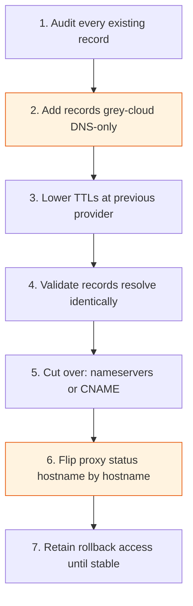

# Migrating DNS

DNS migration is almost always the first real production change in a Cloudflare adoption, and it's unforgiving of shortcuts — a missed record or premature nameserver cutover can take down mail, break a third-party integration, or silently drop traffic. This page lays out a staged approach that keeps every step reversible until you're confident the new configuration is complete and correct.

It assumes you've already made the full-setup-vs-partial-setup decision covered in [DNS Foundation](../foundation/dns-foundation.md) — this page covers the mechanics of getting an existing domain's records onto Cloudflare safely.

## Migration flow

Each step is individually reversible — the highlighted steps (grey-cloud first, staged proxy flip) are what keep it that way.

## Key Cloudflare capabilities

| Capability | What it does | Reference |
|---|---|---|
| Onboard a domain | Cloudflare's guided flow to add a domain, which scans your existing authoritative DNS provider and imports discovered records | [Onboard a domain](https://developers.cloudflare.com/fundamentals/manage-domains/add-site/) |
| Proxy status | Per-record toggle (orange/grey cloud) controlling whether traffic proxies through Cloudflare | [Proxy status](https://developers.cloudflare.com/load-balancing/understand-basics/proxy-modes/) |
| Full setup | Nameserver delegation to Cloudflare as authoritative DNS | [Full setup](https://developers.cloudflare.com/dns/zone-setups/full-setup/setup/) |
| CNAME setup (Partial) | Keep an existing authoritative provider; CNAME individual hostnames to Cloudflare | [CNAME setup (Partial)](https://developers.cloudflare.com/dns/zone-setups/partial-setup/) |
| TTL | Per-record time-to-live, tunable ahead of a cutover | [Time to Live (TTL)](https://developers.cloudflare.com/dns/manage-dns-records/reference/ttl/) |

## Step-by-step approach

**1. Audit every existing record before touching anything.** Export the complete zone file from your current provider (most support a zone file export or API dump) rather than relying solely on Cloudflare's automated onboarding scan — scans can miss records that aren't discoverable by common enumeration (internal-only subdomains, certain TXT/SPF entries, wildcard records with unusual targets). Cross-reference against the [domain onboarding](https://developers.cloudflare.com/fundamentals/manage-domains/add-site/) scan and reconcile gaps. For every record, confirm: is it still in use, what serves it, does it need proxying per [DNS Foundation](../foundation/dns-foundation.md)?

**2. Bring records into Cloudflare grey-clouded first, regardless of setup type.** Add every record as DNS-only initially — including ones that will eventually be proxied. This validates Cloudflare serves the exact same answers as your previous provider before any traffic routes through the proxy, isolating "did DNS resolve correctly" from "did the proxy behave correctly."

**3. Lower TTLs on your current provider well before cutover** — at least 24–48 hours ahead, not the day of. A record with a 24-hour TTL lowered to 300 seconds still has stragglers resolving the old value for up to 24 hours, from caches that fetched it earlier. Don't schedule cutover until the old TTL has fully expired across the Internet.

**4. Validate grey-cloud records resolve identically to the old provider.** Use `dig` (or equivalent) against Cloudflare's assigned nameservers directly (bypassing your resolver's cache) for every critical record — apex, `www`, MX, SPF/DKIM/DMARC — and diff against the previous provider's answers. Mail routing deserves particular attention: a mistake silently breaks outbound deliverability in a way that's hard to detect quickly.

**5. Cut over.** Full setup: update nameservers at your registrar to the two Cloudflare-assigned nameservers, then wait for propagation (minutes to 24+ hours depending on registrar and previous NS TTL — Cloudflare notifies you once it detects the change). Partial (CNAME) setup: add the CNAME record(s) at your existing provider pointing to your assigned `*.cdn.cloudflare.net`-style target — no registrar or nameserver change, which is why partial setup is lower-risk for a first migration.

**6. Flip proxy status hostname by hostname, not all at once.** Once DNS resolution is validated, proxy your least critical hostname first — a marketing subdomain, not the primary API — and confirm it behaves correctly (see [Onboarding a Site](onboarding-a-site.md) for TLS mode and origin protection) before proxying the next. This staged flip is what actually de-risks the migration; the DNS cutover in step 5 is comparatively safe once step 4 is validated.

**7. Keep a rollback plan ready at every step.** Before cutting over nameservers, confirm you still have write access at your previous provider and haven't deleted anything there. A full-setup rollback means re-pointing nameservers back — exactly as slow as the forward cutover — so the real safety net is *not deleting the old records or provider account* until Cloudflare has run successfully for a full TTL-plus-buffer window (a week is a reasonable default). Partial setup rollback is simpler: remove or repoint the CNAME at the existing provider.

## Rollback plan by setup type

| Setup type | Rollback action | Recovery time |
|---|---|---|
| Full (nameserver) | Revert nameservers at registrar to previous provider | Bounded by previous NS record TTL — can be hours |
| Partial (CNAME) | Remove/repoint the CNAME at the existing authoritative provider | Bounded by the CNAME's own TTL — typically minutes |
| Proxy status flip | Toggle the record back to grey-cloud (DNS-only) | Near-immediate |

This favors partial setup for a first, cautious migration: faster, more granular rollback, at the cost of losing DNS-layer DDoS protection and some full-setup-only features until you later convert. See [DNS Foundation](../foundation/dns-foundation.md) for the fuller trade-off discussion.

## Checklist

- [ ] Complete zone file exported from the current provider and reconciled against Cloudflare's onboarding scan
- [ ] Every record's purpose and required proxy status documented (see [DNS Foundation](../foundation/dns-foundation.md))
- [ ] TTLs lowered at the previous provider at least 24–48 hours before cutover
- [ ] All records added to Cloudflare grey-clouded first and validated with `dig` against Cloudflare's nameservers
- [ ] Mail-related records (MX, SPF, DKIM, DMARC) specifically diffed against the previous provider's answers
- [ ] Nameserver or CNAME cutover performed, with rollback access to the previous provider confirmed and retained
- [ ] Proxy status flipped hostname by hostname, starting with the least critical, not all at once
- [ ] Previous provider's records/account retained (not deleted) for at least one full TTL-plus-buffer window after cutover

## Further reading

- [Onboard a domain](https://developers.cloudflare.com/fundamentals/manage-domains/add-site/)
- [Full setup](https://developers.cloudflare.com/dns/zone-setups/full-setup/setup/)
- [CNAME setup (Partial)](https://developers.cloudflare.com/dns/zone-setups/partial-setup/)
- [Proxy status](https://developers.cloudflare.com/load-balancing/understand-basics/proxy-modes/)
- [Time to Live (TTL)](https://developers.cloudflare.com/dns/manage-dns-records/reference/ttl/)
