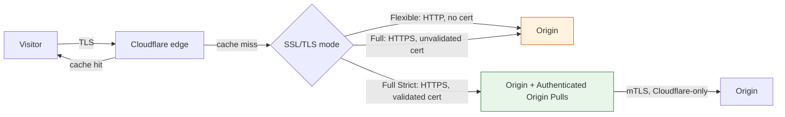

# Onboarding a Site (CDN/Proxy)

Once DNS resolves correctly through Cloudflare (see [Migrating DNS](migrating-dns.md)), the next step is flipping a hostname to proxied (orange-cloud). A handful of decisions determine whether that flip is safe: how Cloudflare talks to your origin over TLS, what gets cached, and how you ensure only Cloudflare — not the public Internet — can reach your origin.

Getting these wrong doesn't always cause an obvious outage. The more common failure mode is a site that "works" but is silently insecure (Flexible SSL leaking plaintext internally) or bypassable (an origin IP still directly reachable, defeating every edge control you just configured).

## Request path

Full (Strict) plus Authenticated Origin Pulls is the only path in this diagram where the origin is unreachable except through Cloudflare — every other path leaves either the transport or the origin itself exposed.

## Key Cloudflare capabilities

| Capability | What it does | Reference |
|---|---|---|
| SSL/TLS encryption modes | Controls how Cloudflare connects to your origin: Flexible (HTTP only), Full (HTTPS, unvalidated cert), Full (Strict) (HTTPS, validated cert) | [Encryption modes overview](https://developers.cloudflare.com/ssl/origin-configuration/ssl-modes/) |
| Authenticated Origin Pulls (AOP) | mTLS between Cloudflare and your origin, so your server only accepts connections presenting a Cloudflare-issued client certificate | [Authenticated Origin Pulls](https://developers.cloudflare.com/ssl/origin-configuration/authenticated-origin-pull/) |
| Cache Rules | Fine-grained, per-URL control over what's cached and for how long, replacing the older blanket "Cache Level" setting | [Cache Rules settings](https://developers.cloudflare.com/cache/how-to/cache-rules/settings/) |
| Edge/Browser Cache TTL | How long Cloudflare's edge and visitors' browsers hold a cached response | [Edge and Browser Cache TTL](https://developers.cloudflare.com/cache/how-to/edge-browser-cache-ttl/) |
| Health Checks | Standalone monitoring of origin uptime/latency, independent of Load Balancing | [Health Checks overview](https://developers.cloudflare.com/health-checks/) |

## Design considerations

**SSL/TLS mode: Full (Strict) is the safe default; the others are transitional or risky, not equivalent alternatives.**

- **Flexible** terminates TLS at Cloudflare's edge and connects to your origin over plain HTTP. No certificate needed on the origin, which is why it's overused — but the Cloudflare-to-server leg stays unencrypted. A publicly reachable origin gets a real interception window, and Flexible can also cause redirect loops with HTTPS-forcing apps. Last resort only, for origins that genuinely can't support any certificate.
- **Full** encrypts the Cloudflare-to-origin leg but doesn't validate the origin's certificate — expired, self-signed, or mismatched-hostname certs pass without complaint. That closes the plaintext problem but leaves you unable to distinguish your real origin from a network-layer attacker. Use it only as a deliberate, temporary step while provisioning a real certificate.
- **Full (Strict)** validates the origin's certificate against a public CA or Cloudflare's own Origin CA — the recommended default whenever possible. Origin CA issues free certificates for exactly this purpose, valid only for Cloudflare-to-origin traffic, removing "no real certificate" as an excuse to skip Strict.

Practical rollout: if your origin lacks a valid certificate, issue one via Cloudflare Origin CA (or Let's Encrypt) *before* flipping the hostname to proxied — land directly on Full (Strict) rather than lingering in Flexible or Full as a forgotten "temporary" state.

**Origin allowlisting matters regardless of SSL/TLS mode.** Proxying a hostname doesn't stop someone from finding your origin's real IP (historical DNS records, certificate transparency logs, misconfigured subdomains) and connecting directly — bypassing every WAF rule and rate limit you've configured. Authenticated Origin Pulls closes this by requiring your origin to accept only TLS connections presenting a valid Cloudflare client certificate; configure it alongside Full (Strict), not as an afterthought. Add firewall rules at the origin (or cloud provider security groups) restricting inbound connections to Cloudflare's published IP ranges, as defense in depth.

**Caching basics: start conservative, then widen deliberately.** By default, Cloudflare only caches static file types by extension (images, CSS, JS) — dynamic HTML isn't cached. Use Cache Rules to define exactly which URL patterns get cached and for how long, rather than "cache everything" on day one; a misconfigured aggressive rule serving stale or user-specific content to the wrong visitor is far worse than under-caching. Respect origin `Cache-Control`/`Expires` headers where your app sets them correctly, and override with Edge/Browser Cache TTL only where they're absent or wrong.

**Health checks catch origin failures before your users report them.** Standalone Health Checks monitor origin availability and latency independent of Load Balancing, alerting before an outage shows up as an error-rate spike. Configure one against a lightweight, representative endpoint — not just a static asset — as part of onboarding, not after the first unnoticed outage.

## Decisions to make

| Decision | Recommended default | When to deviate |
|---|---|---|
| SSL/TLS mode | Full (Strict), using Cloudflare Origin CA if needed | Full only as a short-lived bridge while provisioning a cert; Flexible only if the origin truly cannot terminate TLS |
| Origin protection | Authenticated Origin Pulls + origin firewall restricted to Cloudflare IP ranges | — |
| Caching | Cache Rules scoped to known-static URL patterns | "Cache Everything" only for sites that are fully static or have carefully validated cache-key/vary behavior |
| Health monitoring | A Health Check against a representative endpoint from day one | — |

## Checklist

- [ ] Origin has a valid certificate (Cloudflare Origin CA or public CA) provisioned before the hostname is proxied
- [ ] SSL/TLS mode set to Full (Strict); any use of Flexible or Full is documented as temporary with a follow-up date
- [ ] Authenticated Origin Pulls enabled and origin firewall restricted to Cloudflare's published IP ranges
- [ ] Cache Rules defined explicitly for the URL patterns that should be cached, rather than relying on defaults alone
- [ ] A Health Check configured against a representative (non-static) endpoint
- [ ] Rollback path confirmed: toggling the hostname back to grey-cloud (DNS-only) if onboarding surfaces an unexpected issue

## Further reading

- [Encryption modes overview](https://developers.cloudflare.com/ssl/origin-configuration/ssl-modes/)
- [Flexible mode](https://developers.cloudflare.com/ssl/origin-configuration/ssl-modes/flexible/)
- [Full mode](https://developers.cloudflare.com/ssl/origin-configuration/ssl-modes/full/)
- [Strict (SSL-Only Origin Pull) mode](https://developers.cloudflare.com/ssl/origin-configuration/ssl-modes/ssl-only-origin-pull/)
- [Authenticated Origin Pulls (mTLS)](https://developers.cloudflare.com/ssl/origin-configuration/authenticated-origin-pull/)
- [Default Cache Behavior](https://developers.cloudflare.com/cache/concepts/default-cache-behavior/)
- [Cache Rules settings](https://developers.cloudflare.com/cache/how-to/cache-rules/settings/)
- [Edge and Browser Cache TTL](https://developers.cloudflare.com/cache/how-to/edge-browser-cache-ttl/)
- [Health Checks overview](https://developers.cloudflare.com/health-checks/)
