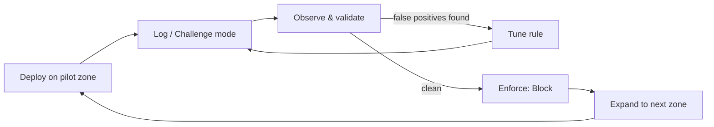

--8<-- "_snippets/disclaimer.md"

# Rolling Out Edge Security

Turning on Cloudflare's edge security products all at once, in blocking mode, across every zone, is how you generate a flood of support tickets and an emergency rollback within a day. Every product below — WAF, rate limiting, bot management — supports a log-first, observe, then enforce pattern, and Cloudflare's own guidance leans on it deliberately, including a built-in staged rollout for its managed rulesets. This page walks through rolling out each control safely, zone by zone, without treating "turn it on" and "block with it" as the same step.

## The rollout pattern

The same loop applies to WAF managed rulesets, custom rules, bot management, and rate limiting — only the specific mode names change (Log, Challenge, Simulate).

## Key Cloudflare capabilities

| Capability | What it does | Reference |
|---|---|---|
| WAF managed rulesets | Pre-built, Cloudflare-maintained rule groups (e.g., Cloudflare Managed Ruleset) covering common attack patterns, auto-updated | [Managed rulesets](https://developers.cloudflare.com/waf/account/managed-rulesets/), [Cloudflare Managed Ruleset](https://developers.cloudflare.com/waf/managed-rules/reference/cloudflare-managed-ruleset/) |
| WAF custom rules | Rules you write against the Rules language, matching on IP, path, headers, body content, and more | [Custom rulesets](https://developers.cloudflare.com/waf/account/custom-rulesets/) |
| Log action / staged rollout | New or updated managed rules deploy in Log-only mode first, then flip to their intended action after roughly a week | [WAF changelog process](https://developers.cloudflare.com/waf/change-log/) |
| Bot Fight Mode / Super Bot Fight Mode | Bot detection and mitigation, from a free baseline to endpoint-tunable challenge/block behavior | [Bot Fight Mode](https://developers.cloudflare.com/bots/get-started/bot-fight-mode/), [Bot Management](https://developers.cloudflare.com/bots/get-started/bot-management/) |
| Bot scores | 1–99 score indicating likelihood of automation, usable in custom rules or Workers | [Bot scores](https://developers.cloudflare.com/bots/concepts/bot-score/) |
| Rate limiting rules | Threshold-based rules (requests per period) with configurable mitigation actions and timeout | [Rate limiting rules](https://developers.cloudflare.com/waf/rate-limiting-rules/) |

## Design considerations

**Log before block, every time, for every rule not already validated elsewhere.** Cloudflare's own managed-ruleset rollout deploys new or updated rules in Log-only mode first — recording matches without blocking — so operators can catch false-positive spikes before enforcement. Apply the same discipline to custom rules and Super Bot Fight Mode: run in Log or Challenge mode, watch analytics for a defined window (a week or two is typical), then flip to Block. Skipping this is the single most common cause of "the WAF broke checkout" incidents.

**Managed rulesets vs. custom rules solve different problems.** Managed rulesets give broad, continuously updated coverage against known attack patterns (SQLi, XSS, common CMS exploits) with minimal effort — deploy the Cloudflare Managed Ruleset as a baseline everywhere. Custom rules encode application-specific knowledge: blocking a scraped path, allowlisting a partner's IP range, rate-limiting an endpoint. Start with managed rulesets in Log mode, then layer custom rules on top — don't replicate general attack-pattern coverage by hand.

**Stage the rollout across zones, not just across rule actions.** Even after a rule proves safe in Log mode, don't flip every zone to Block at once. Pick a low-traffic or non-customer-facing zone first, confirm enforcement matches expectations under real traffic, then expand. This matters most for organizations with many zones of varying traffic patterns — a rule tuned against one application's traffic shape can behave differently against another's.

**Bot management rollout: challenge before block, and tune per endpoint, not globally.** "Block everything that looks automated" also catches legitimate automation — monitoring tools, payment-provider webhook retries, occasionally search crawlers. The safer sequence:

1. Run Bot Fight Mode / Super Bot Fight Mode in Challenge mode for a couple of weeks while reviewing bot analytics.
2. Differentiate by endpoint — block definitively-automated traffic on high-value endpoints like pricing or search APIs; apply a managed challenge on login and checkout.
3. Explicitly allowlist verified good bots (search crawlers, known partner integrations) before enforcing anything more aggressive.

Bot scores (1–99, lower meaning more likely automated) give the granularity for endpoint-specific rules instead of one global setting.

**Rate limiting rollout: start with generous thresholds and tighten.** A rate limiting rule needs a period, a request threshold, and a mitigation timeout. Err toward too-generous first — a too-strict limit silently drops legitimate burst traffic (a double-clicked submit, a mobile client retrying after a flaky connection), harder to notice than an obviously-broken block rule. Apply rate limiting first to endpoints with clear abuse potential — login, password reset, search, checkout — rather than blanket zone-wide limits, and use Log/simulate here too before enforcing.

## Staged rollout sequence

| Stage | Managed rulesets | Custom rules | Bot management | Rate limiting |
|---|---|---|---|---|
| 1. Deploy | Enable on a pilot zone | Write and deploy | Enable Bot Fight Mode / Super Bot Fight Mode | Define threshold on a high-risk endpoint |
| 2. Observe | Log mode (default for new/updated rules) | Log action | Challenge mode | Log/simulate action |
| 3. Validate | Review false-positive rate over ~1–2 weeks | Review match analytics | Review bot analytics, allowlist verified bots | Review legitimate-traffic impact |
| 4. Enforce | Flip to intended action (Block/Challenge) | Flip to Block/Challenge | Move to Block for confirmed-automated traffic, per endpoint | Flip to enforced mitigation action |
| 5. Expand | Roll to remaining zones, one at a time | Roll to remaining zones | Tune per additional endpoint | Apply pattern to other sensitive endpoints |

## Checklist

- [ ] Cloudflare Managed Ruleset deployed as a baseline on every zone, starting in Log mode
- [ ] Custom rules validated in Log mode before switching to Block/Challenge
- [ ] Rollout staged zone by zone, starting with lowest-traffic/lowest-risk zones
- [ ] Bot management run in Challenge mode for a defined observation window before any Block action
- [ ] Verified/legitimate bots (search engines, known partner integrations) explicitly allowlisted before bot blocking is enforced
- [ ] Rate limiting thresholds validated against real traffic patterns in Log/simulate mode before enforcement
- [ ] Rollback plan defined for every control (revert to previous action) before it goes live in enforcing mode

## Further reading

- [Managed rulesets](https://developers.cloudflare.com/waf/account/managed-rulesets/)
- [Cloudflare Managed Ruleset](https://developers.cloudflare.com/waf/managed-rules/reference/cloudflare-managed-ruleset/)
- [Custom rulesets (account level)](https://developers.cloudflare.com/waf/account/custom-rulesets/)
- [Overview of the WAF changelog](https://developers.cloudflare.com/waf/change-log/)
- [Bot Fight Mode](https://developers.cloudflare.com/bots/get-started/bot-fight-mode/)
- [Bot Management](https://developers.cloudflare.com/bots/get-started/bot-management/)
- [Bot scores](https://developers.cloudflare.com/bots/concepts/bot-score/)
- [Rate limiting rules](https://developers.cloudflare.com/waf/rate-limiting-rules/)
