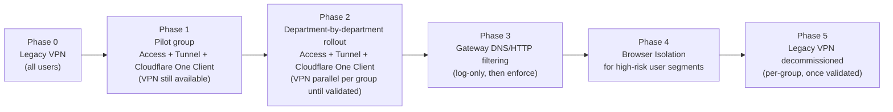

# Zero Trust Adoption Path

Replacing a corporate VPN with Cloudflare's Zero Trust / SASE platform is as much a change management problem as a technical one. The technical pieces (Access, the Cloudflare One Client, Tunnel, Gateway) are well documented, but rolling them out to every employee on day one, cold, fills the helpdesk queue with "I can't reach the internal wiki" tickets.

This page lays out a phased path: pilot group first, then department by department, with DNS/HTTP filtering and Browser Isolation layered in once the core access-replacement is stable. It assumes the identity and account foundation from [Identity & Access Control](../foundation/identity-and-access.md) is already in place — Zero Trust policy is only as good as the identity provider integration behind it.

## Key Cloudflare capabilities

| Capability | What it does | Reference |
|---|---|---|
| Cloudflare Access | Identity-aware proxy that checks every request against policy (identity, group membership, device posture) before allowing access to an application | [Access controls overview](https://developers.cloudflare.com/cloudflare-one/access-controls/) |
| Cloudflare Tunnel (`cloudflared`) | Outbound-only connector from your private network/server to Cloudflare — no inbound firewall holes required | [Cloudflare Tunnel](https://developers.cloudflare.com/cloudflare-one/networks/connectors/cloudflare-tunnel/) |
| Cloudflare One Client (formerly WARP) | Device client that routes selected traffic to Cloudflare's edge for Gateway and Access enforcement, and reports device posture | [About the Cloudflare One Client](https://developers.cloudflare.com/cloudflare-one/team-and-resources/devices/cloudflare-one-client/) |
| Cloudflare Gateway | Secure Web Gateway applying DNS, network (L4), and HTTP (L7) filtering to Cloudflare One Client-routed traffic | [Traffic policies overview](https://developers.cloudflare.com/cloudflare-one/traffic-policies/) |
| Browser Isolation | Remote browser isolation that executes web page code in Cloudflare's cloud rather than on the local device | [Browser Isolation](https://developers.cloudflare.com/cloudflare-one/remote-browser-isolation/) |
| Replace VPN learning path | Cloudflare's own guided path for this exact migration | [Replace VPN: Get started](https://developers.cloudflare.com/learning-paths/replace-vpn/get-started/) |

## Design considerations

**Access + Tunnel first; Gateway and Browser Isolation later.** The highest-value, lowest-risk first step is replacing *inbound* VPN access to specific internal applications — Access (policy) plus Tunnel (connectivity) — rolled out application by application without touching every employee's outbound traffic. Gateway (DNS/HTTP filtering) and Browser Isolation carry a different risk profile: they affect every browsing session, not just internal apps, and deserve their own pilot rather than bundling into the initial VPN replacement.

**Pilot group before org-wide, and pick the pilot deliberately.** Choose a technically comfortable group (IT/platform engineering is common) whose daily workflow touches a representative slice of internal applications — not the group with the simplest access needs, or you won't surface real gaps before wider rollout. Run it through a full work cycle (a sprint or pay-period, not just a day) so edge cases like month-end reporting tools get exercised.

**Migrate applications, not just users.** For each application currently reached over VPN, decide: Cloudflare Tunnel (private, reached via Access policy) or a fully public Cloudflare-proxied application with its own controls? Not everything behind the old VPN needs to stay private-only — reassess which applications actually require network-level isolation versus identity-based access control alone.

**Keep the legacy VPN running in parallel until cutover is validated per group.** Don't decommission VPN infrastructure until each migrated group has operated on Access/Tunnel/Cloudflare One Client for a full cycle without falling back — same "don't delete the old thing until the new thing is proven" discipline as the DNS and security rollouts elsewhere in this framework. See [Migrating DNS](migrating-dns.md) and [Rolling Out Edge Security](rolling-out-security.md).

**Device posture and identity integration are prerequisites, not add-ons.** Access policies are only as strong as the identity groups and device posture signals feeding them. Confirm your IdP integration (SSO, group sync) is solid — see [Identity & Access Control](../foundation/identity-and-access.md) — before writing policies that reference those groups. Decide early which device posture checks (OS version, disk encryption, managed-device status) apply to which application sensitivity tier.

**Gateway rollout follows the same log-before-enforce discipline as WAF.** When extending to Gateway DNS/HTTP filtering, start with monitoring/log-only policies to see what you'd actually be blocking — exactly as described in [Rolling Out Edge Security](rolling-out-security.md). A Gateway policy that blocks a business-critical SaaS tool nobody remembered to allowlist is a fast way to lose trust in the migration.

**Browser Isolation for high-risk users, not everyone, at first.** Rather than rolling it out universally (real cost and latency trade-offs), target users with outsized risk exposure first — administrators, finance staff handling wire transfers, executives who are common phishing targets — then expand based on experience.

## Phased migration flow

Each phase gate should have an explicit exit criterion — for example, Phase 1 exits when the pilot group has completed a full work cycle with no unresolved access-blocking issues, and Phase 5 (decommissioning) only proceeds group by group as each is validated, not as a single global cutover date.

## Decisions to make

| Decision | Recommended default | When to deviate |
|---|---|---|
| Rollout order | Access + Tunnel first, Gateway and Browser Isolation later | If DNS/HTTP filtering is the primary compliance driver, it may need to move earlier |
| Pilot group | Technically comfortable team with representative app usage | — |
| VPN decommissioning | Per-group, after a full validated work cycle on the new stack | Never decommission on a fixed calendar date regardless of validation status |
| Browser Isolation scope | High-risk user segments first | Org-wide only after cost/latency trade-offs are validated at pilot scale |

## Checklist

- [ ] IdP integration (SSO, group sync) validated before writing Access policies
- [ ] Applications inventoried and each assigned a migration path (Tunnel + Access vs. fully public with its own controls)
- [ ] Pilot group selected for technical comfort and representative application usage, run through a full work cycle
- [ ] VPN kept available in parallel per group until that group's migration is validated
- [ ] Gateway policies rolled out in log-only mode before switching to enforce
- [ ] Browser Isolation scoped initially to high-risk user segments, not the whole org
- [ ] Legacy VPN decommissioned per-group only after validation, never on a single fixed cutover date

## Further reading

- [Access controls overview](https://developers.cloudflare.com/cloudflare-one/access-controls/)
- [Cloudflare Tunnel](https://developers.cloudflare.com/cloudflare-one/networks/connectors/cloudflare-tunnel/)
- [About the Cloudflare One Client](https://developers.cloudflare.com/cloudflare-one/team-and-resources/devices/cloudflare-one-client/)
- [Traffic policies overview](https://developers.cloudflare.com/cloudflare-one/traffic-policies/)
- [Browser Isolation](https://developers.cloudflare.com/cloudflare-one/remote-browser-isolation/)
- [Replace VPN: Get started](https://developers.cloudflare.com/learning-paths/replace-vpn/get-started/)
- [Why should you replace your VPN?](https://developers.cloudflare.com/learning-paths/replace-vpn/concepts/why-vpn/)
