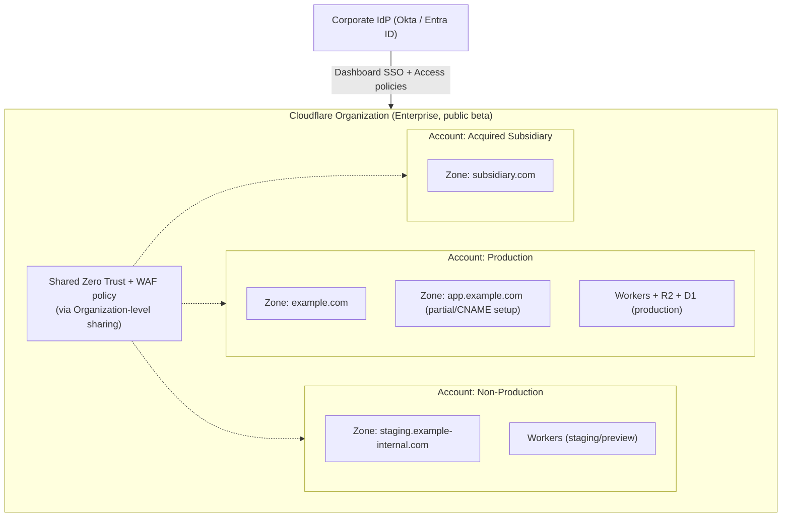

# Accounts & Organizations

Everything in Cloudflare hangs off two container objects: the **account** and the **zone**. A zone is almost always a domain (or subdomain, in a partial/CNAME setup) — it holds DNS records, WAF rules, caching, and most per-site configuration. An account is the billing and membership boundary that owns one or more zones, plus account-scoped products like Workers, R2 buckets, Zero Trust configuration, and account-level API tokens.

Deciding how many accounts your organization needs, and how zones map into them, is the first foundation decision — it constrains every access-control, billing, and blast-radius decision that follows.

Unlike an AWS Organization or an Azure management group hierarchy, Cloudflare's account model wasn't originally built to represent nested corporate structures. The newer **Organizations** and **Tenant** features exist to close that gap — knowing which one applies to you matters.

## Key Cloudflare capabilities

| Capability | What it's for | Reference |
|---|---|---|
| Accounts and zones | The base unit of billing (account) and per-domain configuration (zone) | [Accounts, zones, and profiles](https://developers.cloudflare.com/fundamentals/concepts/accounts-and-zones/) |
| Organizations (Enterprise, public beta) | Lets an Enterprise customer manage multiple *owned* accounts from one pane of glass, share WAF/Zero Trust policy, and view aggregate analytics | [Organizations for Enterprise](https://developers.cloudflare.com/fundamentals/organizations/for-enterprise/) |
| Tenant | A container structure for Cloudflare **partners** (resellers, MSSPs) to create and manage *customer* accounts under a partner agreement | [Tenant: Get started](https://developers.cloudflare.com/tenant/get-started/), [Tenant structure](https://developers.cloudflare.com/tenant/structure/) |
| Account-level API tokens | Machine credentials scoped to a single account rather than a user | [API tokens](https://developers.cloudflare.com/fundamentals/api/get-started/create-token/) |
| Resource Tagging | Attach key-value tags to zones, Workers, R2 buckets, D1 databases, and Tunnels across an account | [Resource Tagging overview](https://developers.cloudflare.com/resource-tagging/) |

Two distinctions worth keeping straight, since this area of Cloudflare's naming shifts periodically:

- **Organizations** (public beta) is for a single Enterprise company that owns multiple accounts — e.g., per business unit or acquired subsidiary — wanting unified visibility and shared policy without merging into one account. It's flat, single-tier (no nested sub-organizations), with limits around 500 accounts and 5,000 zones. Creating one requires 2FA/SSO plus Super Administrator on every account added.
- **Tenant** is a distinct, older structure for Cloudflare **partners** — resellers and MSSPs managing customer accounts. Agencies and MSSPs should start here, not with Organizations.

Don't conflate the two — search results and older posts sometimes use "multi-account" loosely for either.

## Design considerations

**Single account vs. multi-account.** Most small-to-mid organizations should start with a single account and separate concerns with zones, custom roles, and (on Enterprise) API token scoping — not separate accounts. Multiple accounts add real overhead: separate billing, separate member lists to sync, and — until you adopt Organizations — no unified view. Reach for multiple accounts when you have:

- Genuinely separate legal entities or business units that need separate billing and can't share a Super Administrator group.
- Regulatory or contractual requirements to keep one workload's configuration and audit trail fully isolated from another's.
- Different plan tiers or support relationships per business unit (e.g., one Enterprise contract, several self-serve accounts from acquisitions) not yet consolidated.
- A parent/subsidiary structure post-M&A where merging accounts is a multi-quarter project you don't want blocking foundation work.

**Agencies and large enterprises.** Managing Cloudflare for external customers means Tenant, not manually-tracked logins. A single enterprise with several owned accounts should evaluate Organizations — but validate its beta maturity and limits against your scale before betting critical workflows on it.

**How zones map to domains.** A zone typically corresponds to a registrable domain (`example.com`), with subdomains as records inside it. For SaaS or multi-tenant apps serving many customer-owned domains, use Cloudflare for SaaS rather than a zone per customer domain — a different, purpose-built pattern outside this page's scope.

**When to split vs. consolidate.** Split accounts along boundaries that already require separate billing or legal accountability; consolidate everything else into fewer accounts with strong RBAC (see [Identity & Access Control](identity-and-access.md)) and consistent [naming and tagging](naming-and-tagging.md). Every additional account is another place secrets, roles, and IaC state can drift.

## Decisions to make

| Decision | Choose single account when… | Choose multi-account (+ Organizations/Tenant) when… |
|---|---|---|
| Number of accounts | One business, one billing relationship, RBAC can express your isolation needs | Separate legal entities, contracts, or compliance boundaries exist |
| Zone-to-domain mapping | Each domain is a standalone zone | You're serving many customer-owned domains (consider Cloudflare for SaaS instead) |
| Cross-account visibility | Not needed — you have one account | You need shared WAF/Zero Trust policy and aggregate analytics across owned accounts → Organizations |
| Managing external customers | N/A | You're a partner/agency managing customer accounts → Tenant |

## A representative multi-account, multi-zone structure

This is one representative shape, not a prescription — plenty of organizations run everything correctly out of a single account. It illustrates where an Organization adds value: centralized identity, shared security policy, and a single view across accounts that otherwise bill and manage members independently.

## Checklist

- [ ] Decided single-account vs. multi-account based on legal/billing/compliance boundaries, not org-chart mirroring
- [ ] Determined whether Organizations (owned accounts) or Tenant (managed customer accounts) applies, if multi-account
- [ ] Documented which zone maps to which domain, and which zones use full (nameserver) vs. partial (CNAME) setup — see [DNS Foundation](dns-foundation.md)
- [ ] Confirmed 2FA/SSO is enabled for whoever will create an Organization
- [ ] Established a tagging convention for zones and account-scoped resources — see [Naming & Tagging Conventions](naming-and-tagging.md)
- [ ] Cross-referenced account structure against your [Identity & Access Control](identity-and-access.md) plan before inviting members

## Further reading

- [Accounts, zones, and profiles](https://developers.cloudflare.com/fundamentals/concepts/accounts-and-zones/)
- [Organizations for Enterprise](https://developers.cloudflare.com/fundamentals/organizations/for-enterprise/)
- [Organizations public beta changelog](https://developers.cloudflare.com/changelog/post/2026-04-06-organizations-public-beta/)
- [Tenant: Get started](https://developers.cloudflare.com/tenant/get-started/)
- [Tenant structure](https://developers.cloudflare.com/tenant/structure/)
- [Resource Tagging overview](https://developers.cloudflare.com/resource-tagging/)
- [Find account and zone IDs](https://developers.cloudflare.com/fundamentals/account/find-account-and-zone-ids/)
