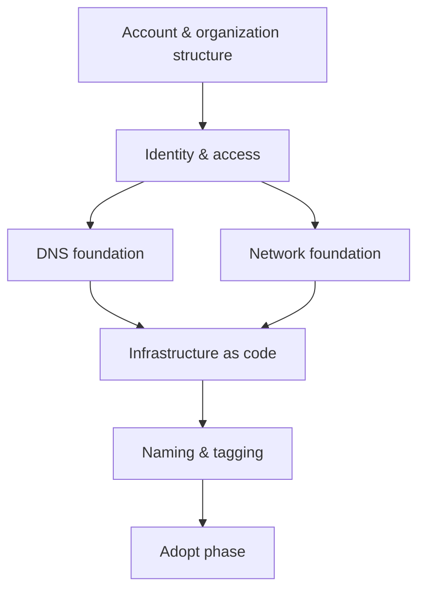

--8<-- "_snippets/disclaimer.md"

# Foundation

The Foundation phase is Cloudflare's version of a "landing zone": the reusable, opinionated baseline every zone, Worker, and Zero Trust policy builds on. Get it wrong and you spend years unwinding inconsistent account structures, orphaned API keys, and unexplained DNS records. Get it right once, and every later zone onboarding, security rollout, or developer platform project becomes repeatable instead of bespoke.

Cloudflare isn't a general-purpose IaaS platform, so its "foundation" doesn't look like an AWS Landing Zone or an Azure management group hierarchy — there's no VPC to design, no subscription hierarchy to map org charts onto. Instead, a Cloudflare foundation rests on six concerns that show up whether you're a five-person startup with one zone or a global enterprise with hundreds of zones and business units:

| Foundation element | What it controls | Page |
|---|---|---|
| Account and organization structure | Where zones, Workers, and billing live; blast radius between business units | [Accounts & Organizations](accounts-and-organizations.md) |
| Identity and access | Who can change what, how they authenticate, and how machine access is scoped | [Identity & Access Control](identity-and-access.md) |
| DNS | The authoritative record of how traffic finds your services, and the trust anchor for everything proxied through Cloudflare | [DNS Foundation](dns-foundation.md) |
| Network | How on-prem networks, data centers, and IP space connect to and through Cloudflare | [Network Foundation](network-foundation.md) |
| Infrastructure as code | How foundation and workload configuration is version-controlled, reviewed, and reproduced | [Infrastructure as Code](infrastructure-as-code.md) |
| Naming and tagging | How humans and automation find and attribute resources consistently | [Naming & Tagging Conventions](naming-and-tagging.md) |

## Why sequence matters

Cloudflare's per-zone, per-account model lets you onboard a domain, turn on the CDN, and start writing WAF rules within an hour, with zero foundation work. That speed is exactly why foundation work gets skipped — and exactly why it needs to happen early. The tax for skipping it:

- **No account structure decision** → security and marketing teams end up sharing one account with no boundary between production zones and test zones, and a single compromised API token can touch everything.
- **No identity strategy** → ten admins hold the Super Administrator role "just in case," turning every phishing attempt against your staff into an account-takeover risk. See [Identity & Access Control](identity-and-access.md).
- **No DNS hygiene** → nobody can tell which of 400 DNS records are still in use, so nothing ever gets deleted, and a routine migration turns into an archaeology project. See [DNS Foundation](dns-foundation.md).
- **No IaC** → WAF rules and Zero Trust policies live only in dashboard state, so there's no diff, no review, no rollback, and no way to reproduce the configuration in a second account after an acquisition. See [Infrastructure as Code](infrastructure-as-code.md).

None of this requires months. A Cloudflare foundation for a mid-size organization is typically a few weeks of deliberate decisions, not a multi-quarter platform build — a meaningful difference from hyperscaler landing zone programs. See [Positioning Cloudflare vs. Hyperscaler Cloud](../strategy/positioning.md) for why that's true architecturally.

## How to use this phase

Work through the pages in this section roughly in order:

1. Decide your [account and organization structure](accounts-and-organizations.md) first — it constrains every later decision about billing, isolation, and who can see what.
2. Lock down [identity and access](identity-and-access.md) before you invite anyone beyond the first two admins.
3. Establish your [DNS foundation](dns-foundation.md) and, if relevant, your [network foundation](network-foundation.md) before onboarding production traffic.
4. Stand up [infrastructure as code](infrastructure-as-code.md) before your rule count grows past what one person can hold in their head.
5. Adopt [naming and tagging conventions](naming-and-tagging.md) from the first zone, not the fiftieth.

Once the foundation is in place, move to the [Adopt phase](../adopt/index.md) to bring existing traffic onto Cloudflare and start building on the developer platform.

## Further reading

- [Accounts, zones, and profiles](https://developers.cloudflare.com/fundamentals/concepts/accounts-and-zones/)
- [Organizations for Enterprise](https://developers.cloudflare.com/fundamentals/organizations/for-enterprise/)
- [Cloudflare Developer Docs home](https://developers.cloudflare.com/)
