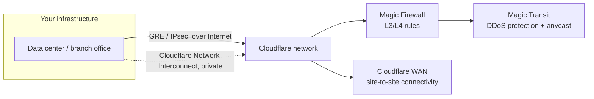

# Network Foundation

Most Cloudflare adoption is web-application-shaped: a zone, some DNS records, a proxy in front of an origin. But organizations with real network infrastructure to protect or connect — data centers, branch offices, IP transit relationships — need Cloudflare at the network layer too, which means an earlier foundation decision: do you need Cloudflare to protect and carry your IP traffic (Magic Transit, Cloudflare WAN), and do you need to bring your own address space onto its network (BYOIP)?

If your workload is "proxy HTTP(S) traffic to an origin," skip straight to [DNS Foundation](dns-foundation.md) and [Onboarding a Site](../adopt/onboarding-a-site.md) — this page is only for organizations that operate actual network infrastructure.

## How traffic reaches Cloudflare

On-ramp choice (GRE/IPsec vs. CNI) is a latency/cost trade-off; Magic Transit and Cloudflare WAN solve connectivity and protection respectively, and most enterprises use both together.

## Key Cloudflare capabilities

| Capability | What it's for | Reference |
|---|---|---|
| Magic Transit | DDoS protection, traffic acceleration, and packet-level filtering for an entire IP network (not just web traffic), using BGP to announce your address space through Cloudflare's anycast network | [Magic Transit Reference Architecture](https://developers.cloudflare.com/reference-architecture/architectures/magic-transit/) |
| Cloudflare WAN (formerly Magic WAN) | Cloud-native WAN replacement for MPLS/hub-and-spoke architectures — connects branch offices and data centers to Cloudflare and to each other | [Cloudflare WAN overview](https://developers.cloudflare.com/cloudflare-wan/) |
| On-ramps (GRE, IPsec, CNI) | The connection methods for getting your network's traffic to Cloudflare: anycast GRE or IPsec tunnels over the public Internet, or a private Cloudflare Network Interconnect (CNI) | [On-ramps](https://developers.cloudflare.com/cloudflare-wan/on-ramps/), [Network Interconnect (CNI)](https://developers.cloudflare.com/cloudflare-wan/network-interconnect/) |
| Magic Firewall | Network-layer (L3/L4) firewall applied to Magic Transit/Cloudflare WAN traffic | [Magic Firewall overview](https://developers.cloudflare.com/magic-firewall/) |
| BYOIP | Bring your own IPv4/IPv6 prefixes onto Cloudflare's network for use with Magic Transit, Spectrum, CDN, or Gateway egress | [BYOIP overview](https://developers.cloudflare.com/byoip/) |

## Design considerations

**Magic Transit and Cloudflare WAN solve a different problem than the CDN/proxy.** The core Cloudflare product (zones, WAF, caching) operates at the HTTP layer — terminating and inspecting web traffic to specific hostnames. Magic Transit and Cloudflare WAN operate at the IP/network layer, relevant when you need to protect or route *all* traffic to a block of IP addresses, not just HTTP(S) to named hosts. "Protect our data center's entire address space" or "replace our MPLS WAN" puts you in that territory; "protect our web applications" almost certainly doesn't — don't reach for network-layer products to solve an application-layer problem.

**Cloudflare WAN vs. Magic Transit is a connectivity vs. protection distinction.** Magic Transit advertises your IP space through Cloudflare's anycast network for DDoS protection and acceleration on inbound traffic. Cloudflare WAN (formerly Magic WAN) replaces traditional WAN architecture — connecting branch offices, data centers, and remote sites to each other and the Internet through Cloudflare instead of MPLS circuits or hub-and-spoke VPN concentrators. Many enterprises adopt both: WAN for connectivity, Magic Transit for protecting the IP space it terminates on. This product line has been renamed and restructured more than once — verify current boundaries and terminology against Cloudflare's docs before finalizing a design.

**On-ramp choice is a latency/cost/complexity trade-off.** Anycast GRE and IPsec tunnels run over the public Internet and are fastest to stand up — good for most branch offices and initial pilots. Cloudflare Network Interconnect (CNI) is a private, dedicated connection bypassing the public Internet — worth it for consistent latency, higher throughput, or a large data center on-ramp that needs off the public path entirely. Don't default to CNI everywhere; it's a procurement and lead-time commitment not every site justifies.

**BYOIP is an enterprise, network-operator-shaped decision.** Bringing your own IP prefixes keeps your addresses associated with your traffic while Cloudflare serves it — useful for reputation continuity (mail servers, allowlisted partner connections) and existing IP-based compliance requirements. It requires holding routable, RIR-registered address space and being ready to have Cloudflare announce it via BGP on your behalf. Not a casual decision — it interacts with Magic Transit, Spectrum, CDN service bindings, and Gateway egress IP configuration. Loop in whoever owns your IPAM and RIR relationships early.

**Connecting on-prem and data-center networks is a phased exercise, not a cutover.** Treat it like any WAN migration: pilot a single non-critical site on a GRE or IPsec on-ramp, validate Magic Firewall rules and routing behavior, then expand and consider CNI for the highest-volume locations once proven.

## Decisions to make

| Question | If yes → | If no → |
|---|---|---|
| Do you need to protect an entire IP network, including non-HTTP protocols? | Evaluate Magic Transit | Standard zone + WAF is likely sufficient |
| Are you replacing MPLS/hub-and-spoke WAN architecture? | Evaluate Cloudflare WAN | Skip network-layer products |
| Do you need a private, dedicated connection (not over public Internet)? | Evaluate Cloudflare Network Interconnect (CNI) | Anycast GRE/IPsec tunnels are simpler and faster to deploy |
| Do you need to preserve your own IP address reputation/compliance posture? | Evaluate BYOIP | Use Cloudflare-owned IP space (the default) |

## Checklist

- [ ] Confirmed the requirement is genuinely network-layer (whole-IP-space protection or WAN replacement), not application-layer
- [ ] Chosen on-ramp type per site (GRE/IPsec vs. CNI) based on latency, throughput, and lead-time needs
- [ ] Identified whether BYOIP is required, and confirmed ownership of RIR-registered prefixes if so
- [ ] Planned a phased rollout starting with one non-critical site before expanding
- [ ] Coordinated Magic Firewall rules with existing on-prem firewall policy before cutover
- [ ] Verified current Magic Transit / Cloudflare WAN terminology and capabilities directly against developers.cloudflare.com before finalizing designs

## Further reading

- [Magic Transit Reference Architecture](https://developers.cloudflare.com/reference-architecture/architectures/magic-transit/)
- [Cloudflare WAN overview](https://developers.cloudflare.com/cloudflare-wan/)
- [On-ramps](https://developers.cloudflare.com/cloudflare-wan/on-ramps/)
- [Network Interconnect (CNI)](https://developers.cloudflare.com/cloudflare-wan/network-interconnect/)
- [Magic Firewall overview](https://developers.cloudflare.com/magic-firewall/)
- [BYOIP overview](https://developers.cloudflare.com/byoip/)
- [Bring your own IP space to Cloudflare (reference architecture)](https://developers.cloudflare.com/reference-architecture/diagrams/network/bring-your-own-ip-space-to-cloudflare/)
