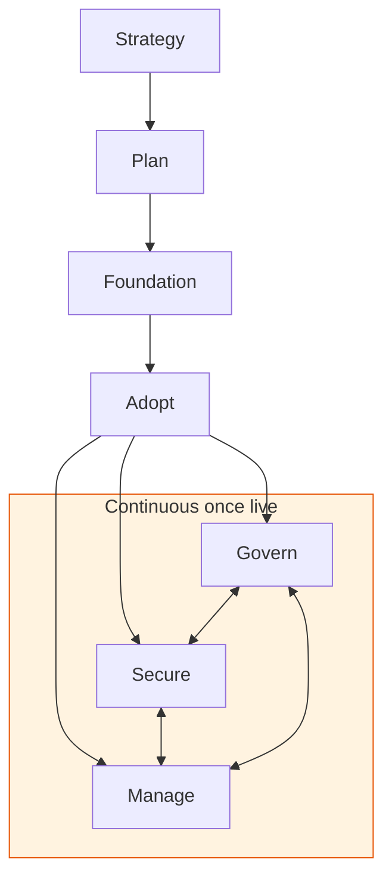

--8<-- "_snippets/disclaimer.md"

# Cloudflare Adoption Framework

Cloudflare is a **specialized hyperscaler**: a global network with the reach of a general-purpose cloud, purpose-built for network, security, and developer-platform workloads instead of general-purpose compute. Adopting it at organizational scale doesn't look like standing up a VM fleet or a VPC peering topology — it looks like configuring one control plane that sits in front of (or increasingly, instead of) your existing infrastructure, running everywhere on the network at once (see ["Region: Earth"](strategy/positioning.md)) rather than region by region.

That's why organizations struggle to adopt it well. Teams onboard a zone, turn on the orange cloud, and stop — without deciding who owns account structure, how WAF changes get governed, whether Zero Trust replaces the VPN, or which workloads belong on the developer platform instead of a hyperscaler. This framework closes that gap: a structured, lifecycle-based approach to planning, deploying, governing, and operating Cloudflare across an entire organization — not just a single domain.

## Who this is for

- **Platform and infrastructure teams** standing up Cloudflare as shared infrastructure for multiple applications, teams, or business units
- **Security architects** deciding how WAF, Bot Management, Zero Trust, and DDoS protection fit into an existing security program
- **Engineering leaders and decision-makers** evaluating Cloudflare against (or alongside) a hyperscaler cloud, and building the business case
- **Anyone inheriting a Cloudflare estate** that grew organically — many zones, inconsistent WAF configuration, no account-level governance — and needs to bring order to it

It assumes you're operating at a scale where "one engineer added the domain to Cloudflare once" isn't good enough anymore — multiple zones, multiple teams touching the dashboard, or compliance/audit requirements that demand a documented approach.

## How this differs from Cloudflare's own documentation

Cloudflare publishes an excellent [Reference Architecture library](https://developers.cloudflare.com/reference-architecture/): design guides, diagrams, and implementation guides for specific solutions — architecting DDoS protection, structuring a Zero Trust rollout, connecting a hybrid network. Go there for "how do I build this specific thing."

This framework answers a different question: how do we adopt Cloudflare as an organization, in what order, and who owns what? It's a lifecycle — strategy, planning, foundational setup, migration, and an ongoing governance/security/operations loop — not a catalog of solution patterns. Think of Reference Architecture as a cookbook of proven recipes, and this framework as the meal-planning process: which recipes to use, in what sequence, and how to run the kitchen afterward. Use them together — this framework points to specific Reference Architecture pages, product docs, and Learning Center articles at the relevant point in the lifecycle.

## The seven-phase lifecycle

This framework uses a seven-phase lifecycle — a linear front half followed by a continuous operational back half — because that shape fits how adoption actually works at scale. Every phase is built around what Cloudflare actually is:

- **Foundation** covers account structure, identity, DNS, and IaC — Cloudflare's answer to a reusable baseline.
- **Secure** is its own continuous phase alongside Govern and Manage, because for a security-and-network company, Zero Trust architecture and edge security posture deserve first-class, ongoing treatment — not a subsection of governance.

Strategy, Plan, and Foundation are sequential — done once, in order, before production traffic hits Cloudflare. Adopt is where zones, security controls, and Zero Trust go live, often in waves. Once live, **Govern, Secure, and Manage run continuously and in parallel** for the life of the estate — ongoing loops that feed each other (a security incident changes governance policy; a governance policy changes what Manage alerts on), not phases you "finish."

## The seven phases at a glance

| Phase | Key decision it answers |
|---|---|
| [Strategy](strategy/index.md) | Why Cloudflare, for which workloads, and what's the business case? |
| [Plan](plan/index.md) | What are we onboarding, which plan tier fits, and is the team ready? |
| [Foundation](foundation/index.md) | How are accounts, identity, DNS, and IaC structured before anything goes live? |
| [Adopt](adopt/index.md) | In what order do zones, security controls, Zero Trust, and workloads actually cut over? |
| [Govern](govern/index.md) | Who can change what, how is spend controlled, and how do we prove compliance? |
| [Secure](secure/index.md) | What's our security baseline, and who's responsible for what (Cloudflare vs. us)? |
| [Manage](manage/index.md) | How do we observe, optimize, and keep improving the estate once it's live? |

## Companion framework: workload-level guidance

This framework operates at the **organization/estate level** — accounts, zones, governance, the adoption lifecycle. For **workload-level** design guidance — architecting a specific application well on Cloudflare, covering reliability, security, cost, operations, and performance trade-offs — see the companion project, [**Cloudflare Well-Architected**](https://github.com/kevinevans1/cloudflare-well-architected). This framework gets the organization ready and governs it; Well-Architected helps each team build well on top of it.

## Further reading

- [Cloudflare Reference Architecture](https://developers.cloudflare.com/reference-architecture/)
- [Cloudflare Developer Docs](https://developers.cloudflare.com/)
- [Cloudflare Well-Architected (companion repo)](https://github.com/kevinevans1/cloudflare-well-architected)
