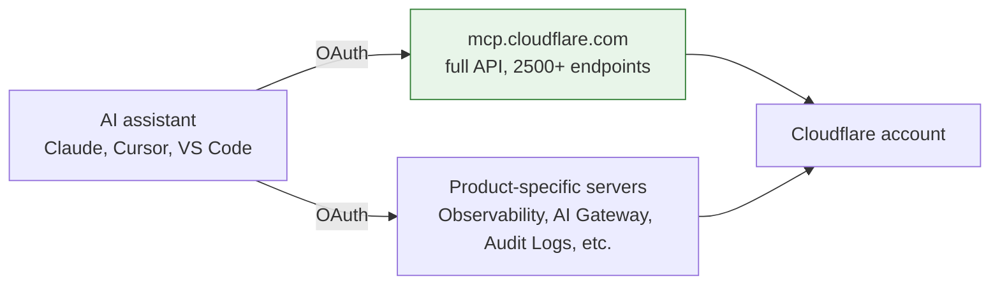

# AI-Assisted Operations (MCP)

Model Context Protocol (MCP) lets an AI assistant — Claude, Cursor, VS Code, or any MCP-compatible client — connect directly to a Cloudflare account and inspect, query, or change it. This is a genuinely new operational capability, and it deserves the same deliberate rollout as any other privileged access path into the estate, not the casual "someone connected it to try it out" adoption pattern that new tools tend to get.

## How it connects

The primary server exposes the entire Cloudflare API surface; the product-specific servers (Observability, AI Gateway, Audit Logs, DNS Analytics, and others) scope access to one product area — prefer the narrower server for a given task over the full-account one, the same instinct that drives scoped API tokens over account-wide keys elsewhere in this framework.

## Key Cloudflare capabilities

| Capability | What it does | Reference |
|---|---|---|
| [Cloudflare API MCP server](https://developers.cloudflare.com/agents/model-context-protocol/cloudflare/servers-for-cloudflare/) | Hosted at `mcp.cloudflare.com/mcp`; gives a connected AI assistant access to the full Cloudflare API for inspecting resources, planning changes, and working across services | [Cloudflare's own MCP servers](https://developers.cloudflare.com/agents/model-context-protocol/cloudflare/servers-for-cloudflare/) |
| Product-specific MCP servers | Narrower servers scoped to one product — Observability, AI Gateway, Audit Logs, DNS Analytics, Radar, Workers Builds, and others — each with its own hosted endpoint | [Cloudflare's own MCP servers](https://developers.cloudflare.com/agents/model-context-protocol/cloudflare/servers-for-cloudflare/) |
| OAuth / API token authentication | Interactive sessions authenticate via OAuth (browser sign-in); automated/CI use can authenticate via a scoped API token instead | [Cloudflare's own MCP servers](https://developers.cloudflare.com/agents/model-context-protocol/cloudflare/servers-for-cloudflare/) |
| [Audit Logs (v2)](https://developers.cloudflare.com/fundamentals/account/account-security/audit-logs/) | Records every account/zone change — including ones made via MCP — the same way it records dashboard or API changes | [Audit Logs](https://developers.cloudflare.com/fundamentals/account/account-security/audit-logs/) |

## Design considerations

**Treat MCP access as a privileged connection, not a developer convenience.** Connecting an AI assistant to the full-account MCP server is functionally similar to handing that assistant an API token with broad account access — [Identity & Access Control](../foundation/identity-and-access.md)'s scoped-token discipline applies here directly. Prefer a product-specific server (Observability, AI Gateway, Audit Logs) over the full-account server whenever the task doesn't need the whole API surface.

**Inspection and read-only use is low-risk; assistant-initiated changes need the same review a human change would get.** Asking an assistant to summarize recent WAF events or explain a DNS record is materially different from asking it to modify a ruleset or delete a zone. [Change Management](../govern/change-management.md)'s log-before-block, reviewed-change discipline doesn't stop applying just because the change originated from an AI assistant's suggestion rather than a human clicking through the dashboard — a human should still be the one who approves and applies anything destructive or production-affecting.

**Audit Logs make AI-driven changes visible after the fact — confirm this is actually being reviewed, not just recorded.** Every change made via an MCP-connected assistant lands in [Audit Logs](https://developers.cloudflare.com/fundamentals/account/account-security/audit-logs/) the same as any other change. That's necessary but not sufficient — someone needs to actually look, especially in the early period of adopting this capability, before assuming the access pattern is safe in practice.

**Start with the narrowest capability that solves the actual problem.** A team wanting AI-assisted debugging of Worker logs needs the Observability server, not the full-account server. A team wanting AI-assisted cost analysis needs the AI Gateway or GraphQL server, not write access to DNS. Match the server to the task.

## Checklist

- [ ] MCP access scoped to the narrowest product-specific server that solves the actual use case, not the full-account server by default
- [ ] A policy exists for which changes an AI assistant can apply directly versus which require human review before applying (mirrors [Change Management](../govern/change-management.md))
- [ ] Audit Logs are actually reviewed for MCP-originated changes, not just retained
- [ ] Interactive OAuth sessions are used for individual use; scoped API tokens are used for any automated/CI integration, not a shared personal login
- [ ] Anyone with MCP access understands it carries the same blast radius as the API scope it's connected to

## Further reading

- [Cloudflare's own MCP servers](https://developers.cloudflare.com/agents/model-context-protocol/cloudflare/servers-for-cloudflare/)
- [Build a Remote MCP server](https://developers.cloudflare.com/agents/model-context-protocol/guides/remote-mcp-server/)
- [Audit Logs (v2)](https://developers.cloudflare.com/fundamentals/account/account-security/audit-logs/)
- [Identity & Access Control](../foundation/identity-and-access.md)
