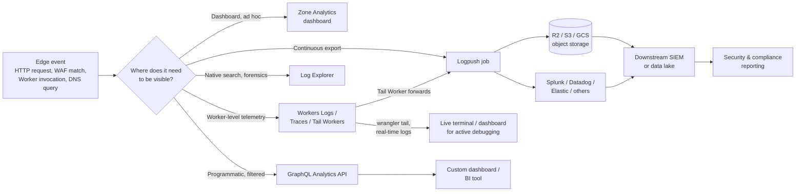

# Observability & Analytics

--8<-- "_snippets/disclaimer.md"

Observability on Cloudflare splits into two concerns that are easy to conflate: **traffic and platform behavior at the edge** (Analytics, the GraphQL Analytics API, Log Explorer, Logpush) and **your own application code running on the edge** (Workers Observability — logs, traces, real-time tailing). A mature operating model uses both, and routes each to the right destination: dashboards for quick human triage, a SIEM or long-term store for security and compliance, real-time tailing for active debugging.

The core design decision is **retention and destination**. Cloudflare's dashboards and Log Explorer give fast, native visibility with no pipeline to build. For long-term retention, correlation with non-Cloudflare telemetry, or compliance-driven storage, logs need to leave Cloudflare via Logpush to a destination you control.

## Key Cloudflare capabilities

| Capability | What it's for | Docs |
|---|---|---|
| Zone Analytics | Dashboard-level traffic, cache, and threat summaries per zone | [Analytics overview](https://developers.cloudflare.com/analytics/) |
| GraphQL Analytics API | Programmatic, filterable access to the same underlying analytics data that powers the dashboard, plus additional datasets (Firewall, Load Balancing, packet-level data for Network Analytics customers) | [GraphQL Analytics API](https://developers.cloudflare.com/analytics/graphql-api/) |
| Logpush | Continuous export of raw request/event logs to a third-party or self-hosted destination | [Logpush overview](https://developers.cloudflare.com/logs/logpush/) |
| Log Explorer | Native, in-dashboard log storage, search, and forensics — no external pipeline required | [Log Explorer](https://developers.cloudflare.com/log-explorer/) |
| Workers Logs | Structured application logs collected and searchable in the dashboard, per Worker | [Workers Logs](https://developers.cloudflare.com/workers/observability/logs/workers-logs/) |
| Real-time logs | Live tailing of a Worker's requests, via dashboard or `wrangler tail` | [Real-time logs](https://developers.cloudflare.com/workers/observability/logs/real-time-logs/) |
| Tail Workers | A Worker attached to another Worker that receives its execution telemetry, so you can filter, sample, or transform logs before they leave Cloudflare | [Workers Observability](https://developers.cloudflare.com/workers/observability/) |
| Traces | Automatic instrumentation of a Worker's fetch calls, binding interactions (KV, R2, Durable Objects), and handler execution | [Traces](https://developers.cloudflare.com/workers/observability/traces/) |
| Query Builder | Structured, no-code querying across Workers telemetry | [Query Builder](https://developers.cloudflare.com/workers/observability/query-builder/) |

### Logpush destinations

Logpush's supported destination list changes over time — verify it before committing to one in an architecture. As of this writing it includes Cloudflare R2, Amazon S3 and S3-compatible endpoints, Google Cloud Storage, Google BigQuery, Microsoft Azure, Datadog, Splunk, Elastic, New Relic, Sumo Logic, IBM QRadar, IBM Cloud Logs, SentinelOne, Amazon Kinesis, Cloudflare Pipelines, and generic HTTP endpoints. See the [enable destinations](https://developers.cloudflare.com/logs/logpush/logpush-job/enable-destinations/) page for the authoritative, current list, including which fields and datasets each destination supports.

## Data flow: edge event to downstream system

The key branch point: **Zone Analytics and Log Explorer keep data inside Cloudflare** for fast, native use. **Logpush is the only path that gets raw logs to a destination you own** — required for SIEM integration, long-term retention, or cross-platform correlation.

## Design considerations

- **Sampling vs. completeness.** Real-time logs and `wrangler tail` are designed for live debugging, not durable audit trails — they are not a substitute for Workers Logs or Logpush when you need a complete record.
- **Retention lives with you, not Cloudflare, once you export.** Logpush hands off logs; retention, indexing, and access control at the destination become your responsibility (and your cost) — factor this into the FinOps view in [Cost Optimization](cost-optimization.md).
- **GraphQL Analytics reflects total traffic, not billable traffic.** Some traffic (e.g., traffic Cloudflare mitigates before it's billable) appears in analytics differently than on an invoice — don't reconcile the two 1:1 without checking the relevant dataset's documentation.
- **Tail Workers add cost and latency risk if overused.** Because a Tail Worker executes on every invocation of the Worker it's attached to, keep its logic minimal (filter/sample/format), not a place to do heavy transformation.
- **Log Explorer vs. Logpush isn't either/or.** Many teams run both: Log Explorer for fast native triage by the team closest to Cloudflare, Logpush to a SIEM for the security team's existing tooling and longer retention windows.

## Decisions to make

| Decision | Options | Notes |
|---|---|---|
| Where does the SOC/security team live? | Log Explorer only / Logpush to existing SIEM / both | If a SIEM already exists (Splunk, Datadog, Elastic), Logpush avoids duplicating tooling |
| What's the log retention requirement? | Cloudflare-native retention / self-managed object storage / SIEM-managed | Compliance obligations (see [Compliance Mapping](../govern/compliance-mapping.md)) often dictate this |
| How is Worker-level debugging handled day to day? | Dashboard real-time logs / `wrangler tail` in local dev / both | `wrangler tail` is the faster loop for active development |
| Who consumes the GraphQL Analytics API? | BI/reporting team building custom dashboards / none, dashboard is sufficient | Only worth building against if the built-in dashboards genuinely don't answer a recurring question |
| Are Tail Workers needed, or is Workers Logs sufficient? | Tail Worker for custom filtering/forwarding / Workers Logs alone | Add a Tail Worker only when you need transformation Workers Logs doesn't provide |

## Checklist

- [ ] Zone Analytics reviewed as part of a regular (at minimum monthly) operating cadence
- [ ] A Logpush job is configured for any log category feeding a SIEM or compliance retention requirement
- [ ] Log Explorer enabled for teams that need native, ad hoc forensic search
- [ ] Workers Logs enabled for every production Worker, not just ones that have already had an incident
- [ ] Real-time log access documented for on-call engineers before an incident, not during one
- [ ] Logpush destination credentials and IP allowlisting reviewed as part of the [Change Management](../govern/change-management.md) process, not a one-off setup step

## Further reading

- [Cloudflare Analytics](https://developers.cloudflare.com/analytics/)
- [GraphQL Analytics API](https://developers.cloudflare.com/analytics/graphql-api/)
- [Logpush overview](https://developers.cloudflare.com/logs/logpush/)
- [Enable Logpush destinations](https://developers.cloudflare.com/logs/logpush/logpush-job/enable-destinations/)
- [Log Explorer](https://developers.cloudflare.com/log-explorer/)
- [Workers Observability](https://developers.cloudflare.com/workers/observability/)
- [Real-time logs](https://developers.cloudflare.com/workers/observability/logs/real-time-logs/)
