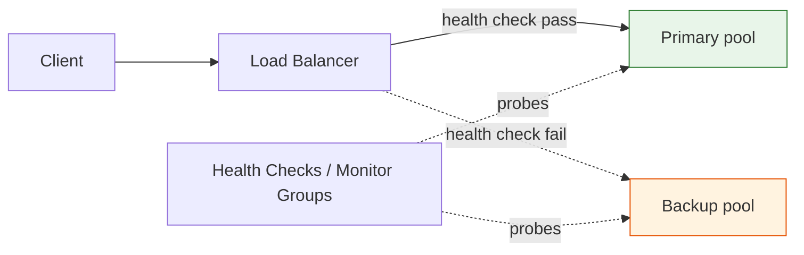

# Reliability Operations

--8<-- "_snippets/disclaimer.md"

Reliability operations on Cloudflare split into two layers with different owners and tooling: **traffic-level reliability** — keeping requests flowing to a healthy origin even when an origin, region, or cloud provider fails — and **data-level reliability** — the consistency guarantees of stateful Cloudflare products (Durable Objects, D1) an application depends on. This page covers both at the operating level: what to monitor continuously and what failure modes to plan for. Availability targets, redundancy patterns, and recovery objectives belong to the companion [Cloudflare Well-Architected](https://github.com/kevinevans1/cloudflare-well-architected) project's Reliability pillar; this page focuses on what to actually configure and watch once a workload is live on Cloudflare.

## Failover at a glance

Steering policy decides *which* healthy pool gets traffic; health checks decide *whether* a pool is eligible at all — they're separate configuration decisions that both have to be right.

## Key Cloudflare capabilities

| Capability | What it does | Docs |
|---|---|---|
| Load Balancing | Distributes traffic across multiple origin pools, with health-check-driven automatic failover | [Load Balancing](https://developers.cloudflare.com/load-balancing/) |
| Health Checks / Monitors | Active, configurable-interval probing of origins from multiple Cloudflare data centers, with pass/fail thresholds and Monitor Groups for compound checks | [Health Checks](https://developers.cloudflare.com/health-checks/) |
| Load Balancing Analytics | Origin uptime, latency, and failure-reason reporting for debugging origin issues | [Load balancing analytics](https://developers.cloudflare.com/load-balancing/reference/load-balancing-analytics/) |
| Steering policies | Controls *which* healthy origin gets a given request: geographic (`geo`), latency-based (`dynamic_latency`), coordinate-based (`proximity`), `random`, `least_outstanding_requests`, `least_connections`, or a fixed default order (`off`) | [Standard steering policies](https://developers.cloudflare.com/load-balancing/understand-basics/traffic-steering/steering-policies/standard-options/) |
| DNS failover | Fallback origin behavior at the DNS layer when Cloudflare Load Balancing isn't in use, or as a complementary layer | [DNS Foundation](../foundation/dns-foundation.md) |
| Durable Objects | Strongly consistent, transactional storage co-located with a single-instance stateful compute unit | [What are Durable Objects?](https://developers.cloudflare.com/durable-objects/concepts/what-are-durable-objects/) |
| D1 read replication | Asynchronous read replicas for D1, with a Sessions API for sequential consistency across replica reads | [D1 global read replication](https://developers.cloudflare.com/d1/best-practices/read-replication/) |

## Load Balancing: health checks, failover, and steering

Cloudflare Load Balancing actively monitors origins — sending configurable requests at set intervals from multiple data centers, checking status code, response text, or timeouts — and routes around an origin (or entire pool/region) that fails. Two configuration choices matter most:

1. **Monitor design.** A monitor that only checks `GET /` returns healthy long after a dependent service (database, cache) has failed. Monitor Groups let you combine multiple checks into one logical health signal so a pool is marked unhealthy only when it's actually unable to serve real traffic.
2. **Steering policy choice.** This determines *which* pool gets traffic among the healthy ones — it is a separate decision from health checking itself:

| Steering policy | Best for |
|---|---|
| `dynamic_latency` | Minimizing latency across geographically distributed pools, using measured round-trip time |
| `proximity` | Similar goal to latency steering, but based on pool lat/long and client location rather than measured RTT |
| `geo` | Regulatory or data-residency requirements where traffic must stay within a region regardless of latency |
| `random` / `least_outstanding_requests` / `least_connections` | Load distribution across same-region, roughly-equivalent pools |
| `off` | Simple primary/backup failover with a fixed default order |

## Multi-origin and multi-cloud failover patterns

Because Load Balancing operates at the Cloudflare edge rather than inside any one cloud provider's network, it's a natural fit for **multi-region and multi-cloud active/passive or active/active failover** — origins in different clouds or regions are just pools with health checks, with no dependency on any provider's own load-balancing or DNS failover service. This is a common reason organizations adopt Cloudflare Load Balancing even without otherwise consolidating onto Cloudflare for CDN/security: it becomes the provider-agnostic failover layer above heterogeneous infrastructure. See [Positioning Cloudflare vs. Hyperscaler Cloud](../strategy/positioning.md) for the broader strategic framing.

**DNS-based failover** — a DNS-only or low-TTL record change pointing traffic at a backup origin — is a valid fallback for zones or record types that can't use the HTTP-layer Load Balancing product, but it inherits DNS's slower propagation and client/resolver caching behavior. Prefer Load Balancing wherever available for materially faster failover.

## Consistency considerations for stateful workloads

Stateful Cloudflare products make different consistency trade-offs, and reliability planning needs to match the guarantee to the workload:

- **Durable Objects** provide strongly consistent, transactional storage, but each instance is single-location by design. The reliability question isn't "can it lose data" (it's durable and consistent within the object) but "what happens to requests while that location is disrupted or migrating" — which is why routing to the correct object ID matters as much as the object's internal consistency.
- **D1** replicates asynchronously to read replicas; a replica can be arbitrarily behind the primary. Any read-after-write requirement must use the D1 Sessions API's sequential consistency guarantee rather than assuming a replica read reflects the latest write.
- Neither product is a drop-in substitute for a traditional multi-region database with configurable consistency levels — model the actual read/write pattern before choosing between Durable Objects, D1, or an external database reached via a Worker.

For deeper guidance on choosing between these primitives and modeling consistency requirements against SLOs, see the Reliability pillar in [Cloudflare Well-Architected](https://github.com/kevinevans1/cloudflare-well-architected).

## Design considerations

- **A steering policy is not a substitute for adequate health-check coverage.** The most common Load Balancing failure mode in practice is a monitor that doesn't actually reflect application health, not a wrong steering policy choice.
- **Test failover, don't just configure it.** A pool marked as backup-only that has never received real traffic can fail silently (stale config, expired certs, drifted capacity) — periodic failover drills catch this before an actual outage does.
- **DNS TTL and failover speed trade off against caching efficiency.** Very low TTLs for fast failover mean more DNS lookups and less resolver-side caching; this is a genuine trade-off, not a free win.
- **Origin error monitoring should feed the same review cadence as everything else in Manage.** Load Balancing Analytics and origin error rates are worth reviewing on the same cadence as cache hit ratio — see [Continuous Improvement](continuous-improvement.md).

## Decisions to make

| Decision | Options | Notes |
|---|---|---|
| Steering policy per Load Balancer | `dynamic_latency` / `proximity` / `geo` / `random` / `least_outstanding_requests` / `off` | Driven by whether the priority is latency, data residency, or simple failover |
| Health check depth | Single endpoint check / Monitor Group across dependencies | Deeper checks catch more real failures but risk false positives from noisy dependencies |
| Failover layer | Load Balancing (HTTP-layer) / DNS-based failover / both | Use Load Balancing wherever the traffic type supports it |
| D1 read consistency model | Sessions API for read-after-write paths / accept eventual consistency for the rest | Should be an explicit per-endpoint decision, not a default |

## Checklist

- [ ] Every production Load Balancer has a health check that reflects real application health, not just TCP/HTTP reachability
- [ ] Steering policy choice is documented with the reason it was chosen (latency, residency, simple failover)
- [ ] Backup/failover pools are exercised periodically, not just configured and left untested
- [ ] Load Balancing Analytics reviewed on a recurring cadence, not only during incidents
- [ ] Any read-after-write requirement against D1 explicitly uses the Sessions API
- [ ] Multi-cloud/multi-region failover patterns documented and cross-referenced with [Positioning Cloudflare vs. Hyperscaler Cloud](../strategy/positioning.md)

## Further reading

- [Cloudflare Load Balancing](https://developers.cloudflare.com/load-balancing/)
- [Health Checks](https://developers.cloudflare.com/health-checks/)
- [Standard traffic steering policies](https://developers.cloudflare.com/load-balancing/understand-basics/traffic-steering/steering-policies/standard-options/)
- [Load balancing analytics](https://developers.cloudflare.com/load-balancing/reference/load-balancing-analytics/)
- [What are Durable Objects?](https://developers.cloudflare.com/durable-objects/concepts/what-are-durable-objects/)
- [D1 global read replication](https://developers.cloudflare.com/d1/best-practices/read-replication/)
- [Cloudflare Well-Architected — Reliability pillar](https://github.com/kevinevans1/cloudflare-well-architected)
