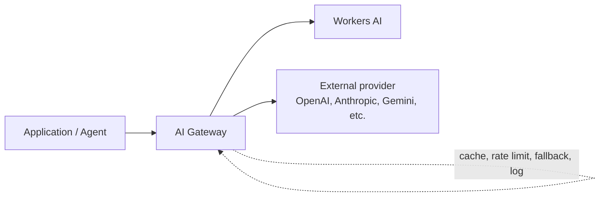

# Scenario: Adopting AI on Cloudflare

Adopting AI isn't a separate platform decision from everything else in this framework — it's the same seven phases, applied to a fast-moving, cost-sensitive, and security-sensitive workload category. The main way organizations get this wrong is treating AI as exempt from the governance and security discipline the rest of the estate already has, because "it's just an API call to a model."

## Where AI traffic fits

The single most important adoption decision in this scenario: route every model call — to Workers AI *or* an external provider — through AI Gateway, not directly. Everything else in this page (cost visibility, guardrails, fallback) depends on that one architectural choice being made early.

## Key Cloudflare capabilities

| Capability | Role | Reference |
|---|---|---|
| [AI Gateway](https://developers.cloudflare.com/ai-gateway/) | Unified control layer in front of any model provider: caching, rate limiting, retries/fallback, logging, and cost analytics | [AI Gateway overview](https://developers.cloudflare.com/ai-gateway/) |
| [Workers AI](https://developers.cloudflare.com/workers-ai/) | Serverless inference on Cloudflare's network, billed in Neurons | [Workers AI overview](https://developers.cloudflare.com/workers-ai/) |
| [Vectorize](https://developers.cloudflare.com/vectorize/) | Vector database for embeddings/similarity search | [Vectorize overview](https://developers.cloudflare.com/vectorize/) |
| [AI Search](https://developers.cloudflare.com/ai-search/) (formerly AutoRAG) | Managed retrieval-augmented generation — handles chunking, embedding, indexing, and hybrid (semantic + keyword) retrieval | [AI Search overview](https://developers.cloudflare.com/ai-search/) |
| [Agents SDK](https://developers.cloudflare.com/agents/) | Framework for building stateful, durable agents on Workers | [Agents overview](https://developers.cloudflare.com/agents/) |
| [AI Security for Apps](https://developers.cloudflare.com/reference-architecture/architectures/ai-security-for-apps/) | Prompt injection/jailbreak detection, PII exposure prevention, and unsafe-topic blocking, running alongside the existing WAF | [AI Security for Apps reference architecture](https://developers.cloudflare.com/reference-architecture/architectures/ai-security-for-apps/) |

## Design considerations

**Strategy: decide build-vs-call before picking a model.** Workers AI is a strong default when data residency, latency, or a simple serverless billing model matter more than access to a specific frontier model; routing to an external provider (OpenAI, Anthropic, Gemini) through AI Gateway is the right call when a specific model's capability is the actual requirement. This isn't a one-time choice — AI Gateway lets you change providers or add fallback without re-architecting the application, which is exactly why it belongs in Foundation, not bolted on later.

**Foundation: AI Gateway is the governance chokepoint, so stand it up before the first production model call.** Once an application calls a model directly, retrofitting cost visibility, caching, and guardrails means changing application code across every call site. Route through AI Gateway from the first integration, the same way [Onboarding a Site](../adopt/onboarding-a-site.md) puts every request through the edge before it reaches an origin.

**Govern: cost and rate limits need owners before spend surprises someone.** Model inference cost (Workers AI Neurons, or external provider token costs visible through AI Gateway's analytics) is exactly the kind of usage-based spend [Cost Governance](../govern/cost-governance.md) already warns about, and AI workloads are more prone to runaway cost than most — a bug that loops a request, or an agent that retries indefinitely, multiplies cost far faster than a normal API bug multiplies compute. Set AI Gateway rate limits per application before launch, not after the first bill.

**Secure: prompt injection is a new class of input validation, not covered by a standard WAF ruleset.** [AI Security for Apps](https://developers.cloudflare.com/reference-architecture/architectures/ai-security-for-apps/) runs prompt injection/jailbreak detection, PII exposure prevention, and unsafe-topic blocking in parallel with existing WAF rules — treat it as a required layer for any application accepting user input that reaches a model, the same way [Edge Security Baseline](../secure/edge-security-baseline.md) treats the Cloudflare Managed Ruleset as a required baseline, not an optional add-on.

**Manage: AI Gateway's analytics are the equivalent of Load Balancing analytics for this workload class.** Review request volume, cache hit ratio, cost, and fallback frequency on the same cadence as the rest of [Observability & Analytics](../manage/observability.md) — a caching opportunity missed here is directly billable, more so than most other underused Cloudflare features.

**Data protection questions don't disappear because the request goes to a model.** Prompts and retrieved context (via Vectorize/AI Search) may contain the same sensitive data [Data Protection](../secure/data-protection.md) already covers — apply the same classification discipline to what gets embedded, indexed, or sent to an external model provider as to any other data flow leaving your control boundary.

## Decisions to make

| Question | If yes → | If no → |
|---|---|---|
| Will this application call any model (Workers AI or external)? | Route it through AI Gateway from day one | — |
| Does the requirement depend on a specific external model's capability? | Evaluate an external provider via AI Gateway | Evaluate Workers AI first |
| Does the workload need retrieval over your own content/documents? | Evaluate AI Search (managed) or Vectorize (build-your-own) | Skip retrieval infrastructure |
| Does the application accept free-text user input that reaches a model? | AI Security for Apps is a required layer, not optional | Standard WAF baseline may be sufficient |
| Is this a multi-step, stateful agent rather than a single request/response call? | Evaluate the Agents SDK | A Worker calling AI Gateway directly is likely sufficient |

## Checklist

- [ ] Every model call (Workers AI or external) routes through AI Gateway — no application code calling a provider's API directly
- [ ] Rate limits and budget alerts configured in AI Gateway before production launch
- [ ] AI Security for Apps enabled for any application accepting free-text input that reaches a model
- [ ] Data classification applied to anything embedded, indexed, or sent to an external model provider
- [ ] AI Gateway analytics (cost, cache hit ratio, fallback frequency) reviewed on the same cadence as other observability data
- [ ] A named owner for AI-related spend, matching [Cost Governance](../govern/cost-governance.md)'s general requirement

## Further reading

- [AI Gateway](https://developers.cloudflare.com/ai-gateway/)
- [Workers AI](https://developers.cloudflare.com/workers-ai/)
- [Vectorize](https://developers.cloudflare.com/vectorize/)
- [AI Search](https://developers.cloudflare.com/ai-search/)
- [Agents SDK](https://developers.cloudflare.com/agents/)
- [AI Security for Apps reference architecture](https://developers.cloudflare.com/reference-architecture/architectures/ai-security-for-apps/)
- [Cloudflare Well-Architected — AI & RAG Workload](https://github.com/kevinevans1/cloudflare-well-architected) for the workload-level architecture pattern
