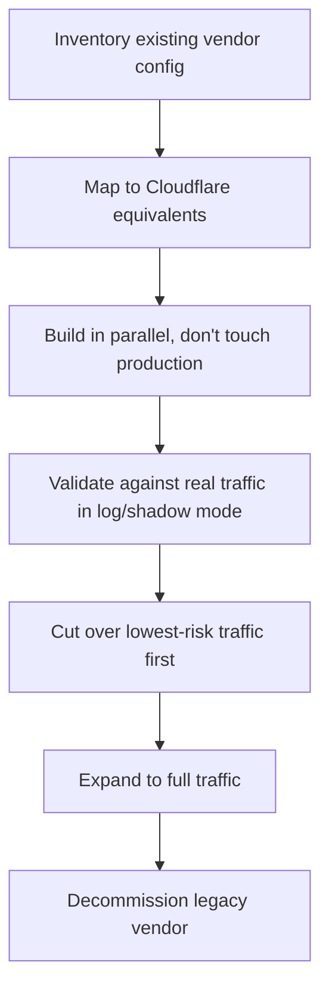

# Scenario: Migrating from a Legacy Vendor

Replacing an existing CDN, WAF, or VPN vendor is a fundamentally different exercise from greenfield adoption — you already have a working configuration, real production traffic, and (usually) a contract end date forcing the timeline. The core risk isn't "will Cloudflare work," it's "will the cutover preserve every rule, record, and behavior nobody remembers configuring."

## Migration flow

The step most teams underestimate is B: legacy WAF rules and VPN policies accumulate undocumented exceptions over years, and a literal one-to-one translation often just migrates old technical debt onto new infrastructure.

## Key Cloudflare capabilities

| Capability | Role in migration | Reference |
|---|---|---|
| [Cloudflare Terraform provider](https://developers.cloudflare.com/terraform/) | Build the target configuration in code, reviewed and tested, before any production cutover | [Terraform provider](https://developers.cloudflare.com/terraform/) |
| [WAF custom rules](https://developers.cloudflare.com/waf/custom-rules/) + [Log action](https://developers.cloudflare.com/waf/change-log/) | Recreate legacy WAF rule logic and validate it in log-only mode against real traffic before enforcing | [Custom rulesets](https://developers.cloudflare.com/waf/account/custom-rulesets/) |
| [Zero Trust / Cloudflare One](https://developers.cloudflare.com/cloudflare-one/) | Replace a VPN concentrator's access policies with Access + Gateway + Tunnel, mapped from existing group/policy structure | [Cloudflare One overview](https://developers.cloudflare.com/cloudflare-one/) |
| [DNS record import/onboarding](https://developers.cloudflare.com/fundamentals/manage-domains/add-site/) | Scans and imports existing DNS records as a starting inventory, cross-checked against a manual export | [Onboard a domain](https://developers.cloudflare.com/fundamentals/manage-domains/add-site/) |
| [Load Balancing](https://developers.cloudflare.com/load-balancing/) | Run legacy and new configuration in parallel behind weighted or staged traffic steering during cutover | [Load Balancing](https://developers.cloudflare.com/load-balancing/) |

## Design considerations

**Inventory before you translate.** Export the legacy vendor's complete configuration — every WAF rule, every VPN access policy, every DNS record — rather than relying on institutional memory. See [Digital Estate & Onboarding Inventory](../plan/digital-estate.md) for the general approach; a migration makes this step non-optional, since "we'll remember what we need" is exactly how a legacy rule silently gets dropped.

**Don't translate rules literally — understand what each one is actually for first.** A legacy WAF ruleset accumulated over years often contains rules nobody would write today: a one-off allowlist for a partner integration that no longer exists, a block rule for an attack pattern that's no longer relevant. Migrating to Cloudflare is a legitimate opportunity to rebuild on [managed rulesets](https://developers.cloudflare.com/waf/managed-rules/) plus a smaller, deliberate set of custom rules — see [Rolling Out Edge Security](../adopt/rolling-out-security.md) — rather than a line-by-line port of technical debt.

**Run in parallel before cutting over, not instead of a rollback plan.** Build the full target configuration in Cloudflare, validate WAF rules in Log mode against mirrored or real production traffic, and confirm DNS records resolve identically — all before the legacy vendor's contract actually ends. A hard contract deadline is exactly when teams are tempted to skip validation; it's exactly when skipping it costs the most.

**VPN-to-Zero-Trust migration needs its own mapping exercise.** Legacy VPN access is usually group-based and network-located ("if you're on the VPN, you can reach the internal network"). [Zero Trust Adoption Path](../adopt/zero-trust-adoption.md) replaces that with per-application, identity-based policy — map each existing VPN group to the specific applications it should retain access to, rather than granting equivalent broad network access through Access/Gateway as a shortcut. The migration is also the opportunity to fix years of VPN group sprawl, not just relocate it.

**Sequence the cutover by risk, and keep the legacy vendor as a rollback path until proven.** Cut over the lowest-traffic, lowest-risk properties first — exactly the staged approach in [Onboarding a Site](../adopt/onboarding-a-site.md) and [Rolling Out Edge Security](../adopt/rolling-out-security.md) — and don't cancel the legacy contract or decommission its configuration until the new setup has run cleanly through at least one full traffic cycle (including any monthly/seasonal peak, if the timeline allows).

## Checklist

- [ ] Complete configuration export from the legacy vendor (WAF rules, VPN policies, DNS records) — not relying on memory
- [ ] Each legacy rule mapped to a Cloudflare equivalent with an explicit decision: keep, drop, or redesign
- [ ] Target configuration built and reviewed in Terraform before touching production
- [ ] WAF rules validated in Log mode against real traffic before enforcement
- [ ] VPN groups mapped to specific Access applications, not one broad network-equivalent policy
- [ ] Cutover sequenced lowest-risk-first, with legacy vendor retained as rollback until validated
- [ ] Contract/decommission timeline confirmed to allow at least one full traffic cycle of validation

## Further reading

- [Digital Estate & Onboarding Inventory](../plan/digital-estate.md)
- [Migrating DNS](../adopt/migrating-dns.md)
- [Rolling Out Edge Security](../adopt/rolling-out-security.md)
- [Zero Trust Adoption Path](../adopt/zero-trust-adoption.md)
- [Cloudflare Terraform provider](https://developers.cloudflare.com/terraform/)
- [Cloudflare Load Balancing](https://developers.cloudflare.com/load-balancing/)
