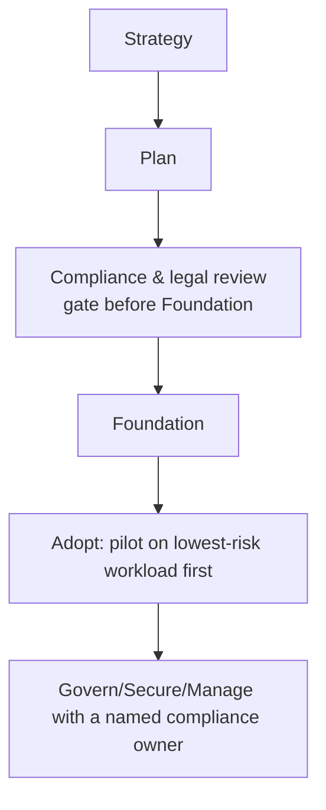

--8<-- "_snippets/disclaimer.md"

# Scenario: Regulated & Compliance-Heavy Orgs

For a regulated organization — finance, healthcare, government, or any sector with sector-specific audit requirements — adoption isn't gated by engineering readiness, it's gated by compliance sign-off. The technical capabilities are the same Cloudflare platform everyone else uses; the difference is *when* compliance and legal get involved, and how much evidence the rollout has to produce along the way.

This page is about sequencing and ownership. For the actual regulatory-to-capability mapping (data residency, PCI DSS, GDPR, audit trails), see [Compliance Mapping](../govern/compliance-mapping.md) — that page is the reference; this page is about not finding out you needed it too late.

## Where this scenario changes the standard sequence

The gate after Plan is the structural difference from the standard lifecycle: a regulated org validates the target architecture against its actual regulatory requirements *before* building Foundation, not after Adopt is already underway.

## Design considerations

**Bring compliance and legal into Strategy, not into a pre-launch review.** The single most common failure mode in this scenario isn't a missing Cloudflare capability — it's discovering a data residency or audit requirement during a pre-launch security review, after Foundation and Adopt decisions (account structure, which regions traffic can touch) are already made and expensive to change. Treat [Compliance Mapping](../govern/compliance-mapping.md) as required reading during [Strategy](../strategy/index.md) and [Plan](../plan/index.md), not [Govern](../govern/index.md).

**Foundation decisions need a compliance lens, specifically account/region structure and identity.** [Accounts & Organizations](../foundation/accounts-and-organizations.md) and [Identity & Access Control](../foundation/identity-and-access.md) should be designed against known regulatory requirements from day one — for example, if [Data Localization Suite](https://developers.cloudflare.com/data-localization/) components are required, confirm current regional availability and plan-tier inclusion before finalizing account structure around them, not after.

**Pilot on the lowest-regulatory-risk workload, not the highest-value one.** [Migration Planning](../plan/migration-planning.md)'s general wave-sequencing advice applies with extra force here: prove the compliance-relevant configuration (Data Localization Suite settings, WAF baseline on payment/PHI-adjacent routes, audit logging) on a workload where a mistake is a fire drill, not a reportable incident, before extending the pattern to regulated production traffic.

**Name a compliance owner inside Govern before go-live, not after an audit request.** [Compliance Mapping](../govern/compliance-mapping.md)'s checklist calls for "a named owner [who] re-checks this mapping at least annually" — in this scenario, that ownership needs to exist *before* production traffic flows, with a defined process for pulling current [Trust Hub](https://www.cloudflare.com/trust-hub/) attestations on demand for an auditor or customer security questionnaire.

**Change management is stricter here than the general baseline.** [Change Management](../govern/change-management.md)'s log-before-block, versioned-ruleset discipline should be treated as a hard requirement, not a best practice, for any zone/route in scope of a regulatory framework — an unreviewed WAF change to a payment page has compliance implications a similar change to a marketing site doesn't.

**Don't let "Cloudflare is compliant" substitute for your own assessment.** As [Compliance Mapping](../govern/compliance-mapping.md) states directly: Cloudflare's own certifications describe Cloudflare's environment, not yours. Your auditor assesses your architecture, which happens to include Cloudflare as a component. Budget time for your own assessment process regardless of Cloudflare's posture.

## Checklist

- [ ] Compliance and legal reviewed the target architecture during Strategy/Plan, before Foundation decisions were finalized
- [ ] Account and region structure ([Foundation](../foundation/index.md)) designed against known data residency/regulatory requirements, not retrofitted
- [ ] Pilot workload for Adopt selected specifically for low regulatory risk, not highest business value
- [ ] A named compliance owner exists before production traffic flows, per [Compliance Mapping](../govern/compliance-mapping.md)'s checklist
- [ ] Change management for in-scope zones/routes follows the strictest [Change Management](../govern/change-management.md) discipline, not the general baseline
- [ ] No internal or external compliance claim is made without a current, dated [Trust Hub](https://www.cloudflare.com/trust-hub/) citation

## Further reading

- [Compliance Mapping](../govern/compliance-mapping.md) — the full regulatory-to-capability reference this scenario sequences around
- [Shared Responsibility Model](../secure/shared-responsibility.md)
- [Change Management](../govern/change-management.md)
- [Cloudflare Trust Hub](https://www.cloudflare.com/trust-hub/)
- [Data Localization Suite](https://developers.cloudflare.com/data-localization/)
