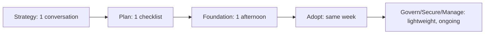

# Scenario: Startup

A startup applying this framework should compress it, not skip it. The seven phases still apply — but a two-person engineering team doesn't need a Foundation phase that takes weeks, and shouldn't provision Enterprise-tier governance for a single zone. This page is the fast path: what to actually do, in what order, before you outgrow it.

## How the phases compress

The Foundation phase is where startups most often either over-invest (designing a multi-account structure for one product) or under-invest (skipping identity hygiene entirely). Neither extreme is right — see below.

## Key Cloudflare capabilities

| Capability | Why it matters for a startup | Reference |
|---|---|---|
| [Cloudflare plans](https://www.cloudflare.com/plans/) | Free and Pro tiers cover most early-stage security/CDN needs without a sales conversation | [Plans overview](https://www.cloudflare.com/plans/) |
| [Workers Free / Paid plans](https://developers.cloudflare.com/workers/platform/pricing/) | Usage-based from day one — no minimum commitment to start building on the developer platform | [Workers pricing](https://developers.cloudflare.com/workers/platform/pricing/) |
| [Pages](https://developers.cloudflare.com/pages/) / [Workers static assets](https://developers.cloudflare.com/workers/static-assets/) | Git-connected deploys with preview URLs, no separate CI to build for a simple site | [Workers static assets](https://developers.cloudflare.com/workers/static-assets/) |
| [Dashboard SSO](https://developers.cloudflare.com/fundamentals/manage-members/dashboard-sso/) | Available even on lower tiers — use it before the third team member gets a shared login | [Dashboard SSO](https://developers.cloudflare.com/fundamentals/manage-members/dashboard-sso/) |
| [Bot Fight Mode](https://developers.cloudflare.com/bots/get-started/bot-fight-mode/) | A meaningful baseline bot defense with no Enterprise contract required | [Bot Fight Mode](https://developers.cloudflare.com/bots/get-started/bot-fight-mode/) |

## Design considerations

**Skip multi-account structure until you have a reason for it.** [Accounts & Organizations](../foundation/accounts-and-organizations.md) covers when multi-account makes sense — for a single product with one team, it almost never does at this stage. One account, clearly named zones, is the right amount of structure.

**Don't skip identity hygiene just because the team is small.** The failure mode isn't complexity, it's informality: shared logins, no [Dashboard SSO](https://developers.cloudflare.com/fundamentals/manage-members/dashboard-sso/), API tokens pasted into Slack. These are cheap to avoid at 3 people and expensive to unwind at 30. Set up SSO and scoped API tokens in the first week, not after the first incident.

**Default to Workers for anything new; don't reach for a hyperscaler VM out of habit.** See [Positioning Cloudflare vs. Hyperscaler Cloud](../strategy/positioning.md) — for a new API, a marketing site, or an MVP, [Building on the Developer Platform](../adopt/developer-platform.md) is usually faster to ship and cheaper to run than provisioning a VM and a separate CDN/WAF vendor on top of it.

**Turn on security defaults; skip staged rollout ceremony for a pre-launch product.** [Rolling Out Edge Security](../adopt/rolling-out-security.md)'s log-before-block staging matters most for an app with real production traffic and users who'll notice a false positive. Pre-launch, enabling the Cloudflare Managed Ruleset and Bot Fight Mode directly is reasonable — there's no traffic pattern yet to break.

**Revisit the plan tier at each real inflection point, not on a schedule.** A funding round, a security questionnaire from an enterprise customer, or a compliance requirement (see [Regulated & Compliance-Heavy Orgs](regulated-industry.md)) are the actual triggers to reassess — not "we're 6 months old now."

**Governance is a checklist, not a program, at this stage.** Full [Govern](../govern/index.md) phase tooling (formal change management, cost governance dashboards) is overhead a 5-person team doesn't need. A shared doc listing who has dashboard access and what's on the API token inventory is enough until the team or the zone count grows.

## Minimal foundation checklist

- [ ] One Cloudflare account, zones named consistently (see [Naming & Tagging Conventions](../foundation/naming-and-tagging.md) for a lightweight scheme)
- [ ] Dashboard SSO enabled before adding a third team member
- [ ] Scoped API tokens for CI/CD — no shared account-wide API key in a `.env` file
- [ ] Cloudflare Managed Ruleset and Bot Fight Mode enabled
- [ ] DNSSEC enabled (low effort, meaningful protection)
- [ ] A single doc listing who has access and why — revisited when the team doubles

## When to graduate out of this scenario

- You're onboarding a second product or a second team touching the dashboard → read [Accounts & Organizations](../foundation/accounts-and-organizations.md)
- A customer's security questionnaire asks about your WAF policy or compliance posture → read [Regulated & Compliance-Heavy Orgs](regulated-industry.md)
- You're replacing an existing CDN/WAF vendor rather than starting fresh → read [Migrating from a Legacy Vendor](legacy-vendor-migration.md)

## Further reading

- [Cloudflare plans](https://www.cloudflare.com/plans/)
- [Workers pricing](https://developers.cloudflare.com/workers/platform/pricing/)
- [Dashboard SSO](https://developers.cloudflare.com/fundamentals/manage-members/dashboard-sso/)
- [Bot Fight Mode](https://developers.cloudflare.com/bots/get-started/bot-fight-mode/)
- [Cloudflare Well-Architected — Startup Workload](https://github.com/kevinevans1/cloudflare-well-architected) for pillar-level guidance on the same stage
