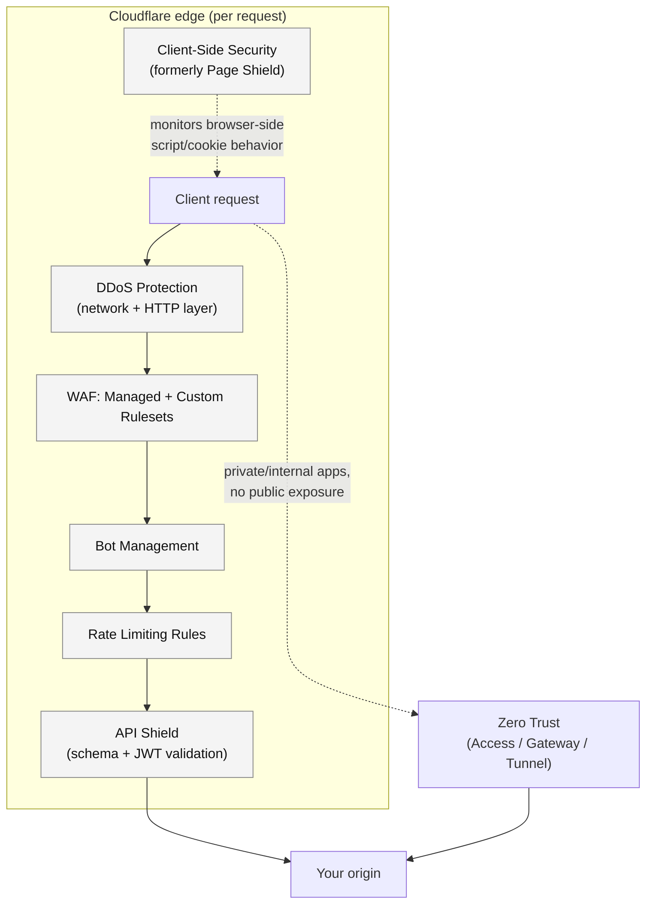

# Edge Security Baseline

Public-facing traffic on Cloudflare passes through a stack of independent security layers before it reaches your origin. Each layer catches a different class of problem and must be deliberately configured — none provide meaningful protection unconfigured. This page covers the layers in evaluation order, what each is good at, and a sane baseline rollout order.

## The layered model

Zero Trust runs as a parallel path, not a later stage in the same pipeline — it's how private/internal applications avoid public exposure entirely rather than a layer public traffic passes through. See [Zero Trust Security Architecture](zero-trust-architecture.md) for that side of the model.

## Key Cloudflare capabilities

| Layer | Catches | Docs |
|---|---|---|
| [DDoS Protection](https://developers.cloudflare.com/ddos-protection/) | Volumetric network-layer (L3/L4) floods and Layer 7 HTTP floods, mitigated automatically at the edge | [developers.cloudflare.com/ddos-protection](https://developers.cloudflare.com/ddos-protection/) |
| [WAF — Managed Rulesets](https://developers.cloudflare.com/waf/managed-rules/) | Known vulnerability classes (SQLi, XSS, RCE patterns) via the [Cloudflare Managed Ruleset](https://developers.cloudflare.com/waf/managed-rules/reference/cloudflare-managed-ruleset/) and [OWASP Core Ruleset](https://developers.cloudflare.com/waf/managed-rules/reference/owasp-core-ruleset/) | [developers.cloudflare.com/waf/managed-rules](https://developers.cloudflare.com/waf/managed-rules/) |
| [WAF — Custom Rules](https://developers.cloudflare.com/waf/custom-rules/) | Application-specific logic Cloudflare's managed content can't know about (your login path, your admin path, your known-bad request patterns) | [developers.cloudflare.com/waf/custom-rules](https://developers.cloudflare.com/waf/custom-rules/) |
| [Bot Management](https://developers.cloudflare.com/bots/) | Automated traffic — scraping, credential stuffing, inventory hoarding — ranging from free [Bot Fight Mode](https://developers.cloudflare.com/bots/get-started/free/) to per-request bot scoring in the Enterprise [Bot Management](https://developers.cloudflare.com/bots/plans/bm-subscription/) tier | [developers.cloudflare.com/bots](https://developers.cloudflare.com/bots/) |
| [Rate Limiting Rules](https://developers.cloudflare.com/waf/rate-limiting-rules/) | Abuse patterns defined by *request volume* rather than payload — brute-force login attempts, API abuse from a single client | [developers.cloudflare.com/waf/rate-limiting-rules](https://developers.cloudflare.com/waf/rate-limiting-rules/) |
| [API Shield](https://developers.cloudflare.com/api-shield/) | API-specific risk: requests that don't match your OpenAPI schema, invalid/expired/tampered JWTs, unauthorized API discovery | [developers.cloudflare.com/api-shield](https://developers.cloudflare.com/api-shield/) |
| [Client-Side Security](https://developers.cloudflare.com/client-side-security/) (formerly Page Shield) | Malicious or unexpected third-party JavaScript running in visitors' browsers — Magecart-style skimming, supply-chain script compromise | [developers.cloudflare.com/client-side-security](https://developers.cloudflare.com/client-side-security/) |

Client-Side Security is structurally different from the other layers: it doesn't inspect inbound requests before they hit your origin — it monitors what scripts, connections, and cookies are executing in the visitor's browser. That's why the diagram shows it observing the client side of the request rather than sitting in the inbound pipeline.

## Design considerations

### Rollout order matters

Turning everything on simultaneously in Block mode is how you generate an incident, not a security posture. A workable sequence, each stage validated in Log mode first (see [Change Management](../govern/change-management.md)):

1. **DDoS protection** — on by default for proxied zones; verify [Advanced TCP Protection](https://developers.cloudflare.com/ddos-protection/) and Adaptive DDoS settings match your plan and traffic profile.
2. **WAF managed rulesets** — deploy in Log mode, observe for false positives against real traffic, then move to Block/Challenge.
3. **Rate limiting** — start with generous thresholds on high-value endpoints (login, checkout, API write paths) and tighten based on observed legitimate traffic patterns.
4. **Bot Management** — start with Bot Fight Mode or Super Bot Fight Mode (depending on plan) in a monitoring posture before moving to active challenge/block for confirmed automated traffic.
5. **API Shield** — requires an accurate OpenAPI schema; schema validation is only as good as the schema, so this typically comes after API endpoints are inventoried (see [Digital Estate & Onboarding Inventory](../plan/digital-estate.md)).
6. **Client-Side Security** — enable monitoring early (it's passive and low-risk to turn on), then act on findings — new/changed scripts, connections to unexpected destinations — as they surface.

### WAF managed vs. custom rules is not either/or

Managed rulesets handle known vulnerability classes; they will never know your application has an admin panel at an unusual path or that a specific parameter should never contain more than a fixed set of values. Custom rules close that gap. Plan for both from the start rather than treating custom rules as an afterthought once the managed ruleset "isn't enough."

### Bot Management tiers are materially different products

[Bot Fight Mode](https://developers.cloudflare.com/bots/get-started/free/) (available on all plans) is a blunt, single-toggle tool. [Super Bot Fight Mode](https://developers.cloudflare.com/bots/get-started/super-bot-fight-mode/) adds more granular controls on Pro/Business. Enterprise [Bot Management](https://developers.cloudflare.com/bots/plans/bm-subscription/) adds per-request bot scores, custom rule integration via the Rulesets engine, and detailed analytics. Don't assume feature parity across tiers when writing runbooks or documentation — check what's actually available on the plan in use.

### Rate limiting characteristics

Rate limiting rules key on a *characteristic* (IP address, a header value, a cookie, etc.) — choosing the wrong characteristic either fails to catch a distributed attacker (too broad) or blocks legitimate shared-IP traffic like corporate NATs or mobile carriers (too narrow). See [Rate Limiting Rules](https://developers.cloudflare.com/waf/rate-limiting-rules/) for the current set of supported characteristics before designing thresholds.

## Decisions to make

- [ ] What mode (Log/Challenge/Block) is each layer running in per zone, and does that match the intended baseline from [Policy & Guardrails](../govern/policy-and-guardrails.md)?
- [ ] Which endpoints get custom rate limiting thresholds beyond the zone default (login, password reset, checkout, public API)?
- [ ] Is there an accurate, maintained OpenAPI schema to drive API Shield schema validation, or does one need to be built first?
- [ ] Who reviews Client-Side Security findings (new scripts/connections) and how often?
- [ ] Which bot management tier is available on the current plan, and does it match the actual automated-traffic risk this application faces?

## Checklist

- [ ] DDoS protection settings reviewed against current traffic/attack profile
- [ ] WAF managed rulesets enabled and enforcing after a log-only soak period
- [ ] Custom rules cover known application-specific risk the managed rulesets can't
- [ ] Rate limiting applied to high-value endpoints with an appropriate characteristic
- [ ] Bot Management tier matches actual risk; not left at default with no review
- [ ] API Shield schema validation active for APIs with a maintained schema
- [ ] Client-Side Security enabled and findings actively triaged, not just collected

## Further reading

- [DDoS Protection overview](https://developers.cloudflare.com/ddos-protection/)
- [WAF managed rules](https://developers.cloudflare.com/waf/managed-rules/)
- [WAF custom rules](https://developers.cloudflare.com/waf/custom-rules/)
- [Rate Limiting Rules](https://developers.cloudflare.com/waf/rate-limiting-rules/)
- [Bot Management overview](https://developers.cloudflare.com/bots/)
- [API Shield overview](https://developers.cloudflare.com/api-shield/)
- [API Shield JWT validation](https://developers.cloudflare.com/api-shield/security/jwt-validation/)
- [Client-Side Security (formerly Page Shield)](https://developers.cloudflare.com/client-side-security/)
- [Ruleset Engine overview](https://developers.cloudflare.com/ruleset-engine/)

See also: [Shared Responsibility Model](shared-responsibility.md) for why none of this is automatic, and [Zero Trust Security Architecture](zero-trust-architecture.md) for the parallel path for private/internal traffic.
