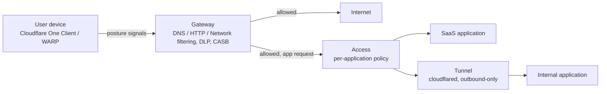

# Zero Trust Security Architecture

[Cloudflare One](https://developers.cloudflare.com/cloudflare-one/) is Cloudflare's Secure Access Service Edge (SASE) platform: it combines Zero Trust Network Access, a secure web gateway, and WAN connectivity into one control plane, enforced at Cloudflare's edge rather than through appliances at each office or data center. This page covers how the four core components compose into a working architecture and where each decision point sits.

## How the components compose

Gateway governs a device's traffic broadly; Access governs one application at a time. Tunnel is the connectivity primitive Access sits in front of — never expose a Tunnel without a matching Access policy.

## Key Cloudflare capabilities

| Component | What it does | Docs |
|---|---|---|
| [Access](https://developers.cloudflare.com/cloudflare-one/policies/access/) | Identity-aware access control in front of self-hosted or SaaS applications — every request is evaluated against a policy before the app is reachable at all | [cloudflare-one/policies/access](https://developers.cloudflare.com/cloudflare-one/policies/access/) |
| [Gateway](https://developers.cloudflare.com/cloudflare-one/policies/gateway/) | Outbound traffic filtering across DNS, network, and HTTP policy layers, plus [DLP](https://developers.cloudflare.com/cloudflare-one/data-loss-prevention/) and [Cloud & SaaS findings](https://developers.cloudflare.com/cloudflare-one/cloud-and-saas-findings/) (CASB) | [cloudflare-one/policies/gateway](https://developers.cloudflare.com/cloudflare-one/policies/gateway/) |
| [Tunnel](https://developers.cloudflare.com/cloudflare-one/networks/connectors/cloudflare-tunnel/) | Outbound-only connector (`cloudflared`) that exposes internal apps/networks to Cloudflare without opening inbound firewall ports | [cloudflare-one/networks/connectors/cloudflare-tunnel](https://developers.cloudflare.com/cloudflare-one/networks/connectors/cloudflare-tunnel/) |
| [WARP](https://developers.cloudflare.com/cloudflare-one/connections/connect-devices/warp/) (now the **Cloudflare One Client**) | Device client that routes traffic through Cloudflare and reports [device posture](https://developers.cloudflare.com/cloudflare-one/identity/devices/) signals policies can key on | [cloudflare-one/connections/connect-devices/warp](https://developers.cloudflare.com/cloudflare-one/connections/connect-devices/warp/) |

## How they compose

Cloudflare publishes its own [SASE reference architecture](https://developers.cloudflare.com/reference-architecture/architectures/sase/), which frames adoption around four building blocks — applications, networks, devices, and users — rather than a fixed product sequence. The practical composition:

- **Tunnel** connects your infrastructure (one app, or an entire private network) to Cloudflare's edge without an inbound listener at the network perimeter — the connectivity primitive everything else builds on for private resources.
- **Access** sits in front of what Tunnel exposes (or in front of SaaS applications) and decides, per request, whether a given identity/device/context is allowed through — the identity-aware control plane for *specific applications*.
- **Gateway** operates at a broader scope than Access: it inspects and filters DNS, network, and HTTP traffic for a user or device generally — not just traffic to one protected app — and is where DLP and CASB (Cloud & SaaS findings) plug in.
- **WARP** (now branded the **Cloudflare One Client**, still commonly called WARP) gets a user's or device's traffic into Gateway's inspection path in the first place, and is the source of device posture signals that both Access and Gateway policies can evaluate.

A minimal but complete SASE posture: the Cloudflare One Client (WARP) on managed devices, routing through Gateway for DNS/HTTP filtering and DLP, with Access policies in front of both internal apps (reached via Tunnel) and SaaS apps, all keyed on identity plus device posture rather than network location.

## Design considerations

### Access is per-application, Gateway is per-user/device

A common design mistake is treating Access as a general network perimeter. It isn't — it evaluates policy per protected application. If the goal is "control what this laptop can reach on the internet generally" (not just one internal app), that's a Gateway policy (DNS or HTTP), not an Access policy. Most real deployments need both: Gateway for broad outbound control, Access for specific application authorization.

### Device posture as a policy input, not a prerequisite

[Device posture](https://developers.cloudflare.com/cloudflare-one/identity/devices/) checks (WARP client running, disk encryption on, a specific certificate present, EDR/AV service healthy) can be required in Access and Gateway policies. Decide early which posture signals are mandatory-to-connect versus merely logged/scored — an overly strict posture requirement rolled out without a pilot phase is a fast way to lock out an entire team's legitimate access.

### DLP and CASB are Gateway-adjacent, not separate products to bolt on later

[DLP](https://developers.cloudflare.com/cloudflare-one/data-loss-prevention/) inspects traffic Gateway already sees for sensitive data patterns (source code, credentials, PII). [CASB / Cloud & SaaS findings](https://developers.cloudflare.com/cloudflare-one/cloud-and-saas-findings/) connects to SaaS APIs directly to scan for misconfigurations independent of traffic inspection. Plan for both as part of the initial Gateway rollout rather than as an afterthought — retrofitting DLP profiles onto years of unstructured Gateway policy is significantly harder than designing them together.

### Tunnel replaces VPN concentrators, not identity

Tunnel removes the need for inbound VPN listeners and the appliance sprawl that comes with them, but it is a connectivity layer, not an authorization layer. An app exposed via Tunnel with no Access policy in front of it is exposed, not secured — always pair Tunnel-exposed resources with an Access policy.

## Decisions to make

- [ ] Which applications are protected by Access individually, versus general traffic governed only by Gateway policy?
- [ ] What device posture signals are required to connect, and is there a pilot/soft-enforcement period before hard enforcement?
- [ ] Are DLP profiles defined before or after Gateway HTTP inspection is turned on broadly — and who owns tuning false positives?
- [ ] Which SaaS applications are in scope for CASB / Cloud & SaaS findings, and who acts on findings?
- [ ] Is WARP deployment mandatory-managed (MDM-pushed) or self-enrolled, and how does that affect policy design?
- [ ] How does this Zero Trust rollout sequence against existing VPN/appliance infrastructure — cutover vs. parallel run?

## Checklist

- [ ] Every Tunnel-exposed application has a corresponding Access policy — none are "just connected" with no policy
- [ ] Device posture requirements piloted before enforced broadly
- [ ] Gateway DNS/HTTP policies cover the intended traffic scope (not just a subset of egress paths)
- [ ] DLP profiles defined for the sensitive data categories relevant to this organization
- [ ] CASB / Cloud & SaaS findings connected for the SaaS apps actually in use
- [ ] WARP rollout plan defined (MDM-managed vs. self-enrolled) and matches device posture policy design

## Further reading

- [Cloudflare One overview](https://developers.cloudflare.com/cloudflare-one/)
- [Cloudflare SASE reference architecture](https://developers.cloudflare.com/reference-architecture/architectures/sase/)
- [Access policies](https://developers.cloudflare.com/cloudflare-one/policies/access/)
- [Gateway policies](https://developers.cloudflare.com/cloudflare-one/policies/gateway/)
- [Cloudflare Tunnel](https://developers.cloudflare.com/cloudflare-one/networks/connectors/cloudflare-tunnel/)
- [WARP client](https://developers.cloudflare.com/cloudflare-one/connections/connect-devices/warp/)
- [Device posture](https://developers.cloudflare.com/cloudflare-one/identity/devices/)
- [Data Loss Prevention](https://developers.cloudflare.com/cloudflare-one/data-loss-prevention/)
- [Cloud & SaaS findings (CASB)](https://developers.cloudflare.com/cloudflare-one/cloud-and-saas-findings/)

See also: [Edge Security Baseline](edge-security-baseline.md) for the parallel public-traffic security stack, and [Zero Trust Adoption Path](../adopt/zero-trust-adoption.md) for a phased rollout sequence.
